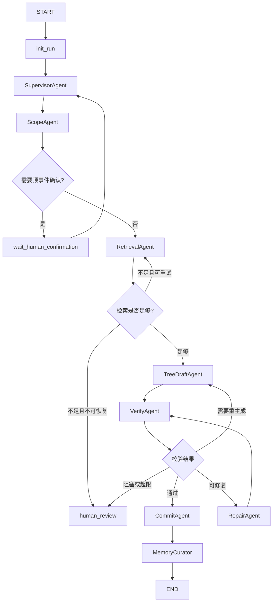

# FTA-GNR 正式自主多智能体系统升级方案

## 1. 背景与目标

当前 FTA-GNR 已经具备轻量多智能体工作流雏形：

- 使用 `agent_runs` 记录任务状态；
- 使用 `agent_events` 记录任务过程；
- 使用 `agent_artifacts` 记录中间产物；
- 已有 `VerifyAgent`、`RepairAgent`、`MemoryCurator` 等角色；
- 前端已经能通过任务进度记录与泳道图展示构建过程。

但当前系统的主要决策仍由 `main.py` 中的固定流程控制，Agent 内部并没有真正自主选择工具。因此它更准确地说是“多阶段 agentic workflow”，还不是正式的自主多智能体系统。

本方案目标是把 FTA-GNR 升级为：

```text
LangGraph 管理全局状态图
SupervisorAgent 负责受控调度
各专业 Agent 在自己的职责边界内自主选择 tools
Run / Event / Artifact 继续作为工程审计与前端展示底座
Domain Memory / Experience Memory 被 Agent 主动检索和使用
```

升级后，系统应满足：

1. 每个核心 Agent 至少拥有明确的 tool 列表，并能在内部自主选择 tool。
2. 全局流程仍受 LangGraph 状态图和确定性 guardrails 约束，避免失控。
3. 每次 Agent 决策、tool 调用、artifact 生成都写入 `agent_events`，兼容现有泳道图和左侧任务消息。
4. 记忆不只是被代码固定读取，而是作为 Agent 可主动调用的 memory tools。
5. 保留现有 `/api/agent/run`、`/api/agent/run/{run_id}`、`/confirm` 接口，不破坏前端。

---

## 2. 框架选择

建议使用：

```text
LangGraph + 自定义 SupervisorAgent + Tool-calling 子 Agent
```

不建议第一版直接使用重型工作流引擎，也不建议只用普通 LangChain AgentExecutor。

### 2.1 为什么使用 LangGraph

FTA-GNR 的任务具有明显状态机特征：

- 先解析需求；
- 再确定知识范围；
- 再检索图谱与 chunks；
- 再构建草稿；
- 再校验；
- 根据校验结果重试、修复、人工确认或持久化；
- 最后沉淀经验记忆。

LangGraph 适合表达这种有状态、多节点、可恢复、可中断的人机协作流程。

### 2.2 为什么需要 SupervisorAgent

SupervisorAgent 负责全局调度，但不能完全放飞给 LLM。推荐采用：

```text
SupervisorAgent 提出 next_action
确定性 router / guardrails 校验 next_action
通过后才进入下一个 Agent 节点
```

这样既有 Agent 决策，又能保证工作流可控。

### 2.3 为什么不直接用 langgraph-supervisor 包

第一版建议自己实现 supervisor node，而不是直接依赖 `langgraph-supervisor` 包。原因：

- 当前项目已有 `Run / Event / Artifact` 体系；
- 需要和前端泳道图精确兼容；
- 需要严格控制持久化和修复权限；
- 自定义 supervisor 更容易和现有数据库、事件流、人工确认接口整合。

---

## 3. 总体架构

升级后的模块结构建议：

```text
FTA-GNR/
  agentic/
    state.py              # LangGraph 全局 State 定义
    graph.py              # 构建 LangGraph
    supervisor.py         # SupervisorAgent
    router.py             # 确定性 guardrail 路由
    tool_registry.py      # tool 注册与权限控制
    tool_events.py        # tool 调用事件记录
    schemas.py            # Agent 输入输出契约

  agents/
    scope_agent.py
    retrieval_agent.py
    tree_draft_agent.py
    verify_agent.py
    repair_agent.py
    commit_agent.py
    memory_curator.py

  tools/
    graph_tools.py
    chunk_tools.py
    validator_tools.py
    repair_patch_tools.py
    correction_tools.py
    persistence_tools.py
```

保留现有：

```text
agent_runtime/
  run_store.py
  event_store.py
  artifact_store.py
  policies.py
```

现有接口保持不变：

```text
POST /api/agent/run
GET  /api/agent/run/{run_id}
POST /api/agent/run/{run_id}/confirm
```

新增灰度开关：

```json
{
  "options": {
    "agentic_version": "v2"
  }
}
```

当 `agentic_version != "v2"` 时，继续走当前 Phase-2 逻辑。这样可以逐步迁移，降低风险。

---

## 4. LangGraph 全局状态图

推荐第一版全局图：

```text
START
  ↓
init_run
  ↓
supervisor
  ↓
scope_agent
  ↓
route_after_scope
  ├─ need_confirmation → wait_human_confirmation → supervisor
  └─ ready
       ↓
retrieval_agent
  ↓
route_after_retrieval
  ├─ retry_retrieval → retrieval_agent
  ├─ human_review → human_review
  └─ ready
       ↓
tree_draft_agent
  ↓
verify_agent
  ↓
route_after_verify
  ├─ passed → commit_agent → memory_curator → END
  ├─ repairable → repair_agent → verify_agent
  ├─ regenerate → tree_draft_agent
  └─ human_review → human_review → END
```

Mermaid 表示：



说明：

- 第一版可以不单独设置 `draft_quality_gate`，让 `VerifyAgent` 处理草稿结构检查；
- 如果后续发现 LLM 经常生成完全坏掉的 JSON，再补一个轻量 `draft_quality_gate`；
- `CommitAgent` 不建议完全自主，它应该是权限严格的确定性节点。

---

## 5. 全局 State 设计

LangGraph State 只保存状态摘要和 artifact 引用，不保存大对象。

```python
class FaultTreeAgentState(TypedDict):
    run_id: str
    session_id: str | None
    project_id: str | None
    canvas_id: str | None

    task_type: str
    prompt: str
    requirements: str

    selected_file_version_ids: list[str]
    scope_key: str

    requested_top_event: str | None
    resolved_top_event: str | None
    normalized_top_event: str | None
    graph_node_id: str | None

    status: str
    current_stage: str
    progress: dict

    confirmation: dict | None

    retrieval_context_artifact_id: str | None
    draft_tree_artifact_id: str | None
    validation_report_artifact_id: str | None
    repair_patch_artifact_id: str | None
    final_tree_artifact_id: str | None

    retrieval_attempt_count: int
    draft_attempt_count: int
    repair_attempt_count: int

    retrieval_summary: dict
    validation_summary: dict
    supervisor_decision: dict | None

    tree_id: str | None
    tree_version: int | None
    error: dict | None
```

大对象存放位置：

```text
tree_data              -> agent_artifacts: tree_draft / final_tree
chunks 正文            -> chunks 集合，通过 chunk_id 查询
subgraph 全量          -> retrieval_context artifact
validation issues      -> validation_report artifact
repair operations      -> repair_patch artifact
```

这样可以避免 LangGraph State 过大，并继续复用现有 `agent_artifacts`。

---

## 6. Blackboard 与 RunState 的关系

当前系统可以升级为轻量 Blackboard 模式：

```text
agent_runs       = RunState，记录当前任务状态与关键 artifact id
agent_artifacts  = Blackboard 内容区，保存每个 Agent 产物
agent_events     = Blackboard 活动日志，记录每次观察、决策、tool 调用
```

Agent 不直接传递大对象，而是通过 artifact id 在 Blackboard 中协作。

示例：

```text
RetrievalAgent 写入 retrieval_context artifact
TreeDraftAgent 读取 retrieval_context_artifact_id
TreeDraftAgent 写入 tree_draft artifact
VerifyAgent 读取 tree_draft_artifact_id
VerifyAgent 写入 validation_report artifact
RepairAgent 读取 tree_draft + validation_report + memory tools
RepairAgent 写入 repair_patch + repaired tree_draft
```

---

## 7. Agent 与 Tools 设计

### 7.1 Tool 通用要求

每个 tool 必须满足：

```text
1. 输入输出使用 Pydantic / TypedDict 契约
2. 不直接暴露 Mongo collection 给 LLM
3. 每次调用写 TOOL_STARTED / TOOL_COMPLETED / TOOL_FAILED event
4. 重要输出写 artifact
5. tool 权限按 Agent 白名单控制
```

标准事件：

```text
AGENT_STARTED
AGENT_DECISION
TOOL_SELECTED
TOOL_STARTED
TOOL_COMPLETED
TOOL_FAILED
ARTIFACT_CREATED
AGENT_COMPLETED
HANDOFF_REQUESTED
HUMAN_CONFIRMATION_REQUIRED
RUN_COMPLETED
RUN_FAILED
```

为了兼容现有前端，事件字段必须继续包含：

```json
{
  "type": "TOOL_COMPLETED",
  "stage": "graph_chunks",
  "message": "Retrieved 8 evidence chunks.",
  "payload": {
    "agent": "RetrievalAgent",
    "tool": "collect_subgraph_chunks",
    "progress": 42,
    "type": "retrieval_context"
  }
}
```

### 7.2 ScopeAgent

职责：

- 解析用户需求；
- 确定顶事件；
- 固化知识范围；
- 需要时发起顶事件确认。

可用 tools：

```text
parse_prompt_tool
resolve_selected_scope_tool
ensure_top_event_catalog_tool
exact_match_top_event_tool
semantic_search_top_events_tool
write_requirement_artifact_tool
write_scope_artifact_tool
build_confirmation_tool
```

输出 artifact：

```text
requirement
scope
```

事件 stage 兼容：

```text
scope
graph_match
```

### 7.3 RetrievalAgent

职责：

- 检索 Neo4j 子图；
- 检索 evidence chunks；
- 检索历史 corrections / repair_patterns；
- 评估召回质量。

可用 tools：

```text
match_graph_top_event_tool
expand_scoped_local_fault_subgraph_tool
collect_subgraph_chunks_tool
hydrate_chunks_tool
keyword_chunk_fallback_tool
retrieve_relevant_corrections_tool
retrieve_active_repair_patterns_tool
rank_evidence_tool
write_retrieval_context_artifact_tool
```

Agent 自主行为示例：

```text
如果子图 chunk 数不足，主动调用 keyword_chunk_fallback_tool
如果 matched graph node 为空，主动调用 semantic_search_top_events_tool 或请求确认
如果历史修正命中度高，写入 retrieval_context.similar_corrections
```

输出 artifact：

```text
retrieval_context
```

事件 stage 兼容：

```text
graph_subgraph
graph_chunks
retrieval
```

### 7.4 TreeDraftAgent

职责：

- 根据 RetrievalContext 构建故障树草稿；
- 自主选择 graph-based 或 chunk-based 构建；
- 规范化前端字段；
- 写入草稿 artifact。

可用 tools：

```text
build_tree_from_subgraph_tool
build_tree_from_chunks_tool
normalize_tree_schema_tool
post_process_generated_tree_tool
attach_document_refs_tool
write_tree_draft_artifact_tool
```

输出 artifact：

```text
tree_draft
```

事件 stage 兼容：

```text
generate_draft
draft
```

### 7.5 VerifyAgent

职责：

- 结构校验；
- 语义校验；
- 证据字段校验；
- 判断 issue 是否 repairable；
- 写入校验报告。

可用 tools：

```text
validate_structure_tool
validate_semantics_tool
validate_evidence_tool
normalize_validation_report_tool
classify_repairability_tool
write_validation_report_artifact_tool
```

输出 artifact：

```text
validation_report
```

事件 stage 兼容：

```text
validate
```

### 7.6 RepairAgent

第一阶段最应该优先真正 agent 化的是 RepairAgent。

职责：

- 根据 validation report 自主选择修复策略；
- 主动使用 Experience Memory；
- 生成并应用 RepairPatch；
- 产出 repaired draft；
- 判断是否转人工。

可用 tools：

```text
find_active_repair_patterns_tool
get_relevant_corrections_tool
build_repair_patch_tool
apply_repair_patch_tool
legacy_llm_repair_tool
revalidate_tree_tool
write_repair_patch_artifact_tool
write_repaired_draft_artifact_tool
request_human_review_tool
```

Agent 自主行为示例：

```text
先观察 validation_report
如果 issue_code 命中历史 pattern，先调用 find_active_repair_patterns_tool
如果 pattern 不足，再调用 get_relevant_corrections_tool
如果结构问题明确，调用 build_repair_patch_tool
如果 patch 应用失败，调用 legacy_llm_repair_tool
修复后调用 revalidate_tree_tool
仍失败则 request_human_review_tool
```

输出 artifact：

```text
repair_patch
tree_draft
validation_report，可选
```

事件 stage 兼容：

```text
repair
validate
```

### 7.7 CommitAgent

职责：

- 保存通过校验的 tree；
- 创建版本；
- 写 final_tree artifact；
- 更新 run completed。

可用 tools：

```text
create_tree_tool
save_version_tool
write_final_tree_artifact_tool
update_run_completed_tool
```

注意：CommitAgent 不建议 LLM 自主决定是否保存。它只在确定性 guardrail 判定可保存后执行。

输出 artifact：

```text
final_tree
```

事件 stage 兼容：

```text
persistence
commit
curate
completed
```

### 7.8 MemoryCurator

职责：

- 在专家保存 AI 生成树的修改版后，沉淀经验；
- 生成 correction_episode；
- 归纳 repair_patterns；
- 控制 AI 自修复经验的 pending / active 状态。

可用 tools：

```text
diff_ai_expert_tree_tool
build_correction_episode_tool
store_correction_episode_tool
derive_repair_patterns_tool
activate_pattern_tool
decay_stale_patterns_tool
```

输出：

```text
correction_episode
repair_patterns
```

---

## 8. 记忆设计与使用

### 8.1 Run Memory

位置：

```text
agent_runs
agent_events
agent_artifacts
```

用途：

- 记录当前任务状态；
- 支持恢复；
- 支持前端任务进度；
- 支持审计 Agent 决策和 tool 调用。

使用方式：

```text
SupervisorAgent 每轮读取 RunState
Agent 节点读取相关 artifact
每个节点结束更新 run 和 state
```

### 8.2 Domain Memory

位置：

```text
Neo4j 图谱
MongoDB chunks
top_event_catalog
file_versions
entity_reverse_index
```

使用 Agent：

```text
ScopeAgent
RetrievalAgent
TreeDraftAgent
VerifyAgent
```

工具化：

```text
search_top_event_catalog_tool
match_graph_top_event_tool
expand_subgraph_tool
collect_chunks_tool
hydrate_chunk_tool
```

要求：

- 所有 domain memory 查询必须带 `selected_file_version_ids` 或 `scope_key`；
- run 开始后不得被 active 版本变化影响；
- 返回给 LLM 的 chunk 正文必须限长，完整正文保留在数据库。

### 8.3 Experience Memory

位置：

```text
corrections
correction_episodes
repair_patterns
```

使用 Agent：

```text
RetrievalAgent
RepairAgent
MemoryCurator
```

工具化：

```text
get_relevant_corrections_tool
find_active_repair_patterns_tool
store_correction_episode_tool
derive_repair_patterns_tool
```

升级重点：

当前 Experience Memory 是代码固定读取。升级后，RepairAgent 应能主动决定是否检索经验。

示例：

```text
RepairAgent 观察到 MISSING_EVENT_FIELD
-> 调用 find_active_repair_patterns_tool
-> pattern 命中不足
-> 调用 get_relevant_corrections_tool
-> 生成 patch
-> 应用 patch
-> 重新校验
```

### 8.4 Memory 使用事件

每次使用记忆都写 event：

```json
{
  "type": "TOOL_COMPLETED",
  "stage": "repair",
  "message": "RepairAgent retrieved 3 active repair patterns.",
  "payload": {
    "agent": "RepairAgent",
    "tool": "find_active_repair_patterns",
    "memory_type": "experience",
    "pattern_count": 3,
    "progress": 68
  }
}
```

这样前端左侧任务消息可以显示：

```text
RepairAgent · 修复智能体：检索到 3 条专家修复经验
```

---

## 9. 与泳道图和任务消息兼容

现有前端泳道图主要依赖：

```text
event.type
event.stage
event.message
event.payload.type / artifact_type
event.payload.progress
```

升级后必须继续输出这些字段。

### 9.1 标准 stage 映射

| 工作流节点 | 推荐 stage | 泳道图节点 |
|---|---|---|
| init_run | `scope` / `scheduler` | 开始 |
| ScopeAgent 顶事件匹配 | `graph_match` | 匹配顶事件 |
| RetrievalAgent 子图展开 | `graph_subgraph` | 扩展局部子图 |
| RetrievalAgent chunk 召回 | `graph_chunks` | 召回证据 Chunk |
| TreeDraftAgent 生成草稿 | `generate_draft` | 生成草稿 |
| VerifyAgent 校验 | `validate` | 校验通过? / 校验通过 |
| RepairAgent 修复 | `repair` | 历史修正 / 修复 |
| CommitAgent 保存 | `persistence` / `commit` | 保存版本 |
| 完成 | `completed` / `curate` | 成功 / 完成 |
| 失败 | `failed` | 失败 |

### 9.2 标准事件 payload

```json
{
  "agent": "RetrievalAgent",
  "tool": "collect_subgraph_chunks",
  "progress": 42,
  "type": "retrieval_context",
  "artifact_id": "art_xxx"
}
```

其中：

- `payload.agent` 用于左侧消息智能体归属；
- `payload.tool` 用于展示 tool 调用；
- `payload.progress` 用于进度条；
- `payload.type` 用于泳道图识别 artifact；
- `stage` 用于节点变蓝。

### 9.3 左侧任务消息显示建议

前端当前已经将事件映射为：

```text
ScopeAgent · 范围智能体
RetrievalAgent · 检索智能体
TreeDraftAgent · 草稿智能体
VerifyAgent · 校验智能体
RepairAgent · 修复智能体
CommitAgent · 持久化智能体
MemoryCurator · 记忆整理智能体
SchedulerAgent · 调度智能体
```

后端升级时应尽量直接在 payload 中写明 `agent`，减少前端推断。

推荐事件：

```json
{
  "type": "TOOL_SELECTED",
  "stage": "graph_chunks",
  "message": "RetrievalAgent selected collect_subgraph_chunks because graph context is available.",
  "payload": {
    "agent": "RetrievalAgent",
    "tool": "collect_subgraph_chunks",
    "reason": "graph context is available",
    "progress": 34
  }
}
```

---

## 10. 可控性设计

自主多智能体必须有边界。建议使用四层控制。

### 10.1 LangGraph 拓扑控制

Agent 不能任意跳转。只能沿图中允许的边流动。

例如：

```text
RepairAgent 只能回 VerifyAgent 或 HumanReview
TreeDraftAgent 不能直接 Commit
RetrievalAgent 不能直接 SaveVersion
```

### 10.2 Tool 权限控制

每个 Agent 只能看到自己的工具。

示例：

```python
AGENT_TOOL_ALLOWLIST = {
    "RetrievalAgent": [
        "match_graph_top_event",
        "expand_subgraph",
        "collect_chunks",
        "retrieve_relevant_corrections",
    ],
    "RepairAgent": [
        "find_active_repair_patterns",
        "get_relevant_corrections",
        "build_repair_patch",
        "apply_repair_patch",
        "revalidate_tree",
    ],
    "CommitAgent": [
        "create_tree",
        "save_version",
        "write_final_tree_artifact",
    ],
}
```

### 10.3 Deterministic Guardrails

关键路由不完全相信 LLM。

例如：

```python
if validation_report["passed"]:
    next_node = "commit_agent"
elif blocking_error_count > 0:
    next_node = "human_review"
elif repair_attempt_count >= MAX_REPAIR_ATTEMPTS:
    next_node = "human_review"
elif repairable_error_count > 0:
    next_node = "repair_agent"
else:
    next_node = "human_review"
```

SupervisorAgent 可以提出建议，但最终由 guardrail 校验。

### 10.4 写库权限控制

写库类 tool 必须满足：

```text
validation passed
tree_data 存在
run_id 匹配
artifact_id 匹配
非重复提交
```

CommitAgent 不允许 LLM 直接传任意 Mongo 更新语句。

---

## 11. 兼容现有接口

### 11.1 `/api/agent/run`

请求新增可选参数：

```json
{
  "prompt": "请生成电池故障保护故障树",
  "selected_file_version_ids": ["fv_1"],
  "options": {
    "agentic_version": "v2",
    "max_repair_attempts": 2,
    "max_retrieval_attempts": 2
  }
}
```

响应仍保持：

```json
{
  "mode": "queued",
  "run_id": "run_xxx",
  "status": "running",
  "current_stage": "scope",
  "events": []
}
```

### 11.2 `/api/agent/run/{run_id}`

继续支持：

```text
after_event_seq
include_tree_data
```

但建议新增：

```text
include_artifact_summary=true
```

用于前端展示 Agent 产物摘要。

### 11.3 `/confirm`

继续用于顶事件确认。LangGraph 中对应 interrupt / resume：

```text
wait_human_confirmation
```

---

## 12. 分阶段落地计划

### 阶段 1：基础设施与兼容层

目标：不改变现有业务结果，先搭好 LangGraph v2 入口。

任务：

- 新增 `agentic/state.py`；
- 新增 `agentic/tool_registry.py`；
- 新增 `agentic/tool_events.py`；
- 新增 `agentic/graph.py`；
- `/api/agent/run` 根据 `options.agentic_version` 分流；
- 所有 v2 事件保持兼容前端泳道图。

验收：

- v1 不受影响；
- v2 能创建 run；
- v2 能写标准 event；
- 前端任务进度记录能看到 Agent 和 tool 消息。

### 阶段 2：RepairAgent 真正 tool-calling 化

目标：先让一个 Agent 具备真实自主工具选择。

任务：

- 改造 `RepairAgent`；
- 注册 repair tools；
- RepairAgent 根据 validation report 自主选择 memory tools 和 patch tools；
- 每次 tool 调用写 event；
- 修复后回 VerifyAgent。

验收：

- RepairAgent 不再只是固定调用函数；
- 能主动查询 repair_patterns / corrections；
- 能解释 tool 选择原因；
- 前端能看到 RepairAgent 的多条 tool 消息。

### 阶段 3：RetrievalAgent tool-calling 化

目标：让检索阶段具备自主 fallback 能力。

任务：

- 注册 graph/chunk/correction retrieval tools；
- RetrievalAgent 判断子图召回是否足够；
- 不足时主动 fallback 到 keyword/chunk recall；
- retrieval_context 中记录 evidence quality。

验收：

- 图谱召回不足时不会直接失败；
- 前端泳道图 `匹配顶事件 -> 扩展局部子图 -> 召回证据 Chunk` 节点稳定变蓝；
- 左侧消息显示 RetrievalAgent 的 tool 调用过程。

### 阶段 4：SupervisorAgent 与 LangGraph 完整替换 Phase-2

目标：把 `main.py` 中 `_run_agent_second_phase` 的固定循环迁移到 LangGraph。

任务：

- SupervisorAgent 读取 state 和 artifact summaries；
- SupervisorAgent 输出 next_action；
- deterministic router 校验 next_action；
- 支持 human confirmation interrupt/resume；
- 支持 run recovery。

验收：

- v2 可完整生成、修复、提交；
- run 中断后可恢复；
- 不会无限循环；
- commit 仍受严格 guardrail 控制。

### 阶段 5：MemoryCurator 与 Experience Memory 增强

目标：让经验记忆形成闭环。

任务：

- 专家保存后写 correction_episode；
- 从 correction_episode 归纳 repair_patterns；
- pattern 增加 success_count / failure_count / last_used_at；
- RepairAgent 使用 pattern 后记录反馈。

验收：

- 专家修改能沉淀；
- 后续修复能主动使用经验；
- 无效 pattern 不会长期污染默认检索。

---

## 13. 风险与限制

### 13.1 Agent 自主性与稳定性的冲突

风险：

```text
Agent 自主选择 tool 后，可能绕远路、重复调用、误判下一步。
```

控制：

```text
max_tool_calls
max_repair_attempts
max_retrieval_attempts
deterministic router
tool allowlist
```

### 13.2 LLM 输出不稳定

控制：

```text
结构化输出 schema
tool 参数 Pydantic 校验
失败后写 TOOL_FAILED event
必要时 fallback 到现有确定性逻辑
```

### 13.3 前端进度兼容

控制：

```text
stage 使用现有泳道图识别值
payload.type 保留 artifact 类型
payload.progress 保留进度
payload.agent / payload.tool 显示 Agent 和 tool
```

### 13.4 迁移风险

控制：

```text
options.agentic_version = "v2" 灰度
保留当前 Phase-2
先 agent 化 RepairAgent
再 agent 化 RetrievalAgent
最后迁移 Supervisor
```

---

## 14. 最终目标形态

升级完成后，FTA-GNR 应从：

```text
main.py 固定流程
  -> 函数调用
  -> 少量 Agent class
```

变成：

```text
LangGraph StateGraph
  -> SupervisorAgent 受控调度
  -> ScopeAgent 自主选择范围工具
  -> RetrievalAgent 自主选择检索工具和记忆工具
  -> TreeDraftAgent 自主选择构建工具
  -> VerifyAgent 自主选择校验工具
  -> RepairAgent 自主选择经验记忆与修复工具
  -> CommitAgent 受控持久化
  -> MemoryCurator 沉淀经验
```

并且所有步骤都能被前端看到：

```text
左侧任务消息：每条消息来自具体 Agent / tool
右侧泳道图：每个节点根据 stage 和 event 变蓝
后端审计：Run / Event / Artifact 可恢复、可回放、可排查
```

这才是符合本项目需要的“正式、真正、但仍可控”的自主多智能体系统。
