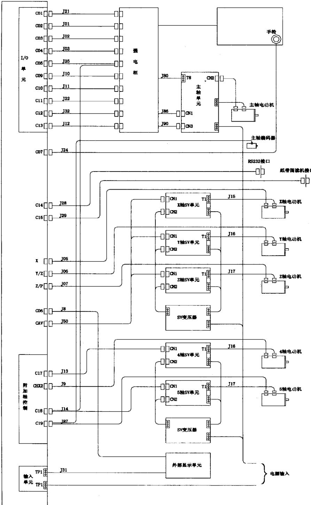  
图2-1FS6M系统总体结构与连接框图

## 2.1.2 FANUC11系统

FS11是 FANUC 公司20世纪 80年代初期开发并得到广泛应用的 FANUC 代表性产品之一，在 80 年代进口的高档数控机床上广为采用，因此，它亦是维修中的常见系统之一。同系列的产品有FS110/11/12三种基本规格，其基本结构相似，性能与使用场合有所区别。

FS11 的硬件仍然采用大板结构，系统采用了比FS6 更为先进的68000系列微处理器与专用大规模集成电路，如：BAC（总线仲裁控制器）、IOC（输入输出控制器）、MB87103（位置控制芯片）、OPC(操作面板控制器）以及SSU（系统支持单元）等，使系统的元器件数比 FS6 减少了30%。4M 的大容量磁泡存储器、A/D 和 D/A模块以及ATC（自动刀具交换装置)和APC(自动托盘交换装置)控制用定位模块的应用，使系统的性能比FS6 有了大大的提高。FS11 配有高速、大容量的 PMC，最大 PMC 程序存储容量为 16000 步，可以控制的 I/O点数多达752/496 点。PMC 采用了FANUC 开发的混合电路，输出驱动模块的驱动能力可以达到 200V/2A，可以直接驱动机床的执行元器件。

CNC 系统和操作面板、I/O单元之间通常采用光缆连接，连接简单，抗干扰能力强。FS11 系统既可以带独立安装的电柜，也可以进行分离式安装。伺服驱动与主轴驱动一般采用FANUC 模拟式交流伺服驱动系统。

系统软件为固定式专用软件，最大可以控制 5 轴，并实现全部控制轴的联动。系统还可以选择并联轴控制、3D刀补、手动任意角度进给等多种功能。

系统采用了菜单操作的软功能面板，可以进行简单的人机对话式编程。此外系统还具有 PMC 诊断与 PMC 程序的动态显示功能，使系统具有比 FS6 更强的自诊断能力与更高的可靠性。

以上性能在当时(20 世纪 80 年代)都具有相当先进的水平，从而使系统在当时的机床行业，特别是高档、进口数控设备上得到了广泛的应用。

FS11的典型产品FS11M的总体结构与连接框图如图2-2所示。

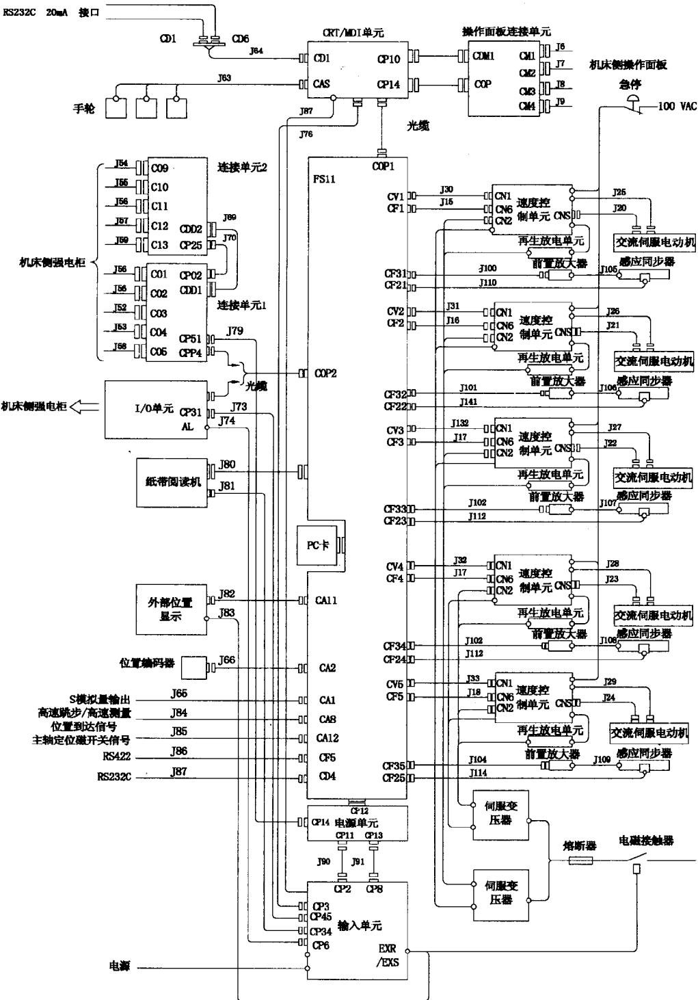  
图2-2FS11M系统的总体结构与连接框图

## 2.1.3FANUC0系统

FSO是FANUC公司20世纪80年代中、后期开发的产品，是FANUC代表性产品之一。产品在全世界机床行业得到了广泛的应用，是中国市场上销售量最大的一种系统。FSO 系列共有 FSO – MA、FSO – TA、FSO – MC、FSO – TC、FSO – MD、 FSO – TD、PMO、 FSOi等多种规格，其基本结构相近，功能与使用场合有所不同。其中，FSO.MC/TC是其中代表性的产品，功能最强，使用最广；FSO- MD 和 FSO－ TD、PMO 是在FSO- MC 及 FSO- TC 的基础上，经过功能精简而成的系统，由于其性能/价格比高，故也被大量用于数控车床及数控铣床。

FSO 的硬件结构采用了传统的结构方式，即：在主板上插有存储器板、I/O板、轴控制模块以及电源单元等，只是其主板较其他系列的主权要小得多，因此，在结构上显得较紧凑，体积小。

FSO 系列是一种采用了高速 32位微处理的高性能的CNC。控制电路中采用了高速微处理器、专用大规模集成电路、半导体存储器等器件，提高了系统可靠性与系统的性能价格比。

FSO可以配套使用FANUCS系列、α系列、 $\alpha \mathrm { C }$ 系列、β系列等高速数字式交流伺服驱动系统，无漂移影响，可以实现高速、高精度的控制。

该系列系统采用了高性能的固定软件与菜单操作的软功能面板，可以进行简单的人机对话式编程。系统还保留了FS11 的 PMC 诊断与 PMC 程序的动态显示功能，可显示出从 CNC 输出或向 CNC 输入的开关量信号;通过 CRT，还可以利用独立的页面显示系统的快进速度、加/减速时间常数等各种参数的设定值。通过MDI（手动数据输入)方式，还可以对机床的开关量输入、输出信号进行模拟。

FSO系统的代表性产品FSO-MC的总体结构与连接框图如图2-3所示。

PMO、FSOi系统的特点是采用了总线技术，增加了网络功能，并采用了“闪存”（FLASH ROM)。系统可以通过 Remote buffer 接口与个人计算机相连，由计算机控制加工，实现信息传递；系统间也可以通过I/Olink总线进行连接。

由于系统采用了“闪存”（FLASHROM），使它不仅可以像其他FSO系统那样直接在系统的操作面板上编制、调试 PMC 程序，而且 PMC 程序的写入可以不需要 EPROM 写入器，用户可方便地修改、调整 PMC程序，且省去了EPROM 的写入设备。

FANUCOi的总体结构与连接框图如图2-4所示。

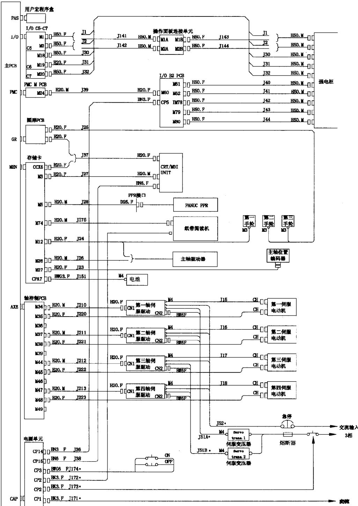  
图2-3FS0-MC总体结构与连接框图

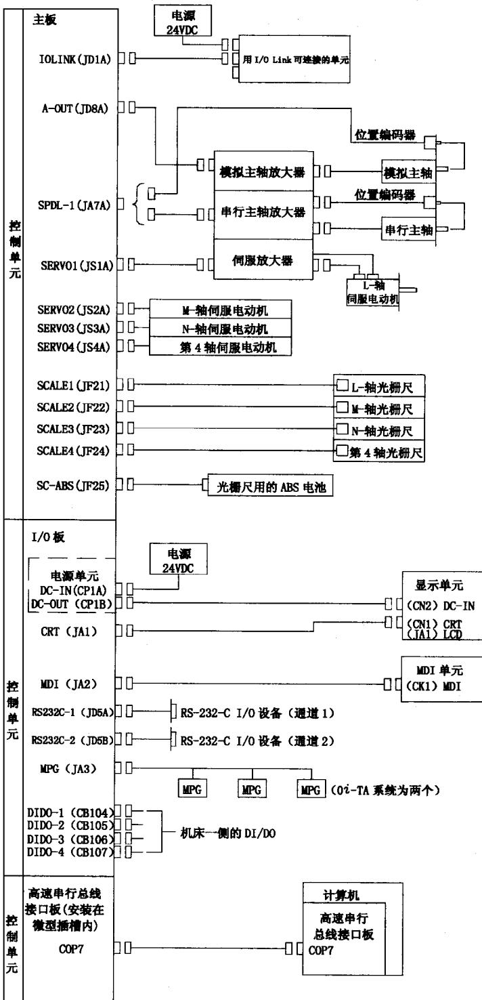  
图2-4FANUCOi的总体结构与连接框图

## 2.1.4 FANUC 15/16/18 系统

FS - 15/16/18/16i/18i系列系统有FS-15/16/18、FS15i/l6i/18i及 FS-150/160/180、FS160i/180i等型号，该系列系统是专门为工厂自动化设计的数控系统，它是目前国际上性能最先进、功能最强大的数控系统之一，系统具有以下特点：

1)系统硬件与微电子技术发展同步，采用了超大规模集成芯片，CPU可以是 80486或PENTIUM 系列处理器，带 64 位RISC 芯片等。此外，FANUC 公司还开发了较多的专用超大规模逻辑电路芯片，如：地址译码和锁存、位置反馈信号的处理、精细插补、位置误差的比较与误差的脉宽调制、串行数值信号的处理与数据传送、电子手轮信号的处理等等。系统的处理速度快、精度高、可靠性好，位置分辨率可达 $0 . 0 1 ~ \mu \mathrm { m }$ ，以实现微小程序段的连续、高速加工。

2)系统元器件采用了立体化、高密集的安装方式（FANUC公司的专利技术）。除主板外，印制电路板均按物理功能分成小模块，根据用户的要求和系统的规模，分别插在主板上，系统扩展容易，维修方便，体积小。

3)系统采用8.4in或9.5inTFT彩色液晶显示器，4096色、256色可以同时显示。色彩丰富，清晰度高。系统还可以集成通用微机，使用MS- DOS 和WtwDOWS 操作系统，共享 IBM 微机的应用软件。在此基础上，FANUC 公司还开发了专用的 MMC人机会话功能，可以使用菜单编程、图形会话编程(Saper CAP)、符号图形编程(Symblic CAP)、以及示教编程等多种在线编程方法，大大提高了系统的操作性能。

4)系统软件丰富，功能强大，具有渐开线、抛物线、指数函数曲线、圆弧螺纹、多头螺纹、变螺距螺纹、锥螺纹、端面螺纹、柱面体型槽、极坐标插补等多种特殊曲线的插补功能与多种固定加工循环。系统还具有操作历史和报警历史的记忆与显示、伺服波形图的显示功能与“帮助”（Help)功能，当出现报警和故障时，它可以提示操作和维修人员进行处理。

5)系统可配套α/ai系列高精度、智能型数字式交流伺服系统，伺服电动机体积小、转距/惯量比大、加速快、运行平稳，即使在极低的转速下仍能满负荷运行。伺服控制采用了独立的32位数字信号处理器，并按现代控制理论，设计成具有预测控制、前馈控制、控制观察器、电子式电流最佳控制（HRV控制）的闭环系统。位置脉冲编码器可用增量式或绝对式位置编码器，反馈脉冲可达到每转 20000000 脉冲，还可以实现双重位置环反馈与控制。

主轴控制亦可采用α/αi 系列的主轴驱动系统，用32位高速信号处理器进行控制，并通过高速串行接口与 CNC 进行数据交换，构成闭环控制系统。除可以调节主轴转速外，还可以实现任意位置定位、C 轴控制、双主轴的精确同步等功能。此外，主轴驱动器还可以带有非正常负载检测功能，可检测出由于刀具折断、磨损和加工中的负载故障。

6)系统带有高速 PMC，基本指令的执行时间为每步0.1μs，梯形图最大可达 24000步。PMC 由独立的 32 位微处理器控制，既可直接在系统的操作面板上编制 PMC 程序，也可用通用PC机编制PMC程序，PMC程序可直接存入存储器中。

7)FS-15/16/18系列系统既可单机运行，也可通过 Remote buffer接口与个人计算机相连，由计算机控制加工，实现信息传递。通过I/O link（串行口)接口还可以连接多种外围设备，如：机器人、运动控制器、强电设备等，以组成柔性线。另外，经DNC1或DNC2接口，可与 Cell Controller 或以太网连接，由上位机进行控制，实现车间的自动化。在 FS- 160/180中还提供了一个与IBM PC 兼容的开放接口，便于用户开发具有个性化的功能。

FS16/18系统的总体结构如图2-5所示。

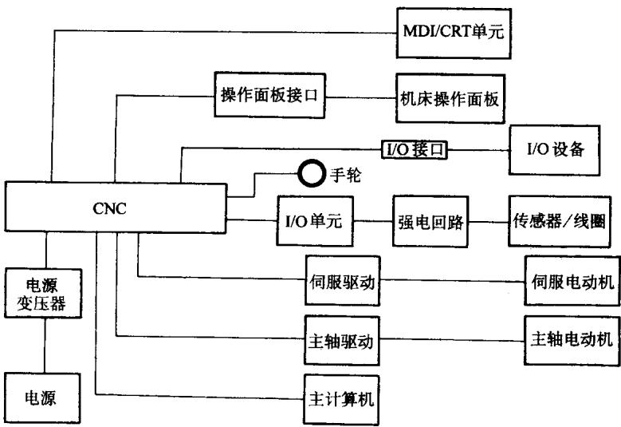  
图2-5FS16/18系统的总体结构

## 2.2FANUC 系统的故障诊断

FANUC 系统是数控机床上使用最广、维修过程中遇到最多的系统，这些系统虽然功能、配置在各机床中各不相同，但由于系统的基本设计思想相同，因此，故障诊断的方法

十分相近，根据不同的故障情况，系统诊断的方法如下。

## 2.2.1电源不能接通的故障诊断

FANUC公司早期生产的数控系统（如:FS6、FS11、FS0等），系统的电源通/断控制，一般都配套有FANUC公司生产的独立型“输入单元”模块（模块号：A14C-0061-B101～B104)，通过相应的外部控制信号，进行数控系统、伺服驱动的电源通、断控制。而在FANUC 0 系统中，则比较多地采用输入单元与电源集成一体的电源控制模块 FANUCAI电源单元。

对于采用独立型“输入单元”模块的FANUC 系统，电源不能接通的故障诊断，可以根据输入单元上的绿色状态指示灯PIL、电源报警红色指示灯ALM 的状态，进行如下检查，判断故障原因。

## （1)电源指示灯PIL不亮

1)CNC 电源未加入，端子TP1上无电源。应根据机床生产厂家的电气原理图，检查机床中与CNC电源输入有关的电路。

2)端子TP1上有电源。应检查电源输入熔丝F1、F2是否熔断。

3)若熔丝和电源电压均正常，应检查输入单元的辅助电源控制回路的熔丝F3是否熔断；辅助电源控制回路是否存在故障。

(2)电源指示灯PIL亮，报警指示灯ALM不亮这是电源模块的正常工作状态，如果在这状态下仍然无法接通系统电源，可能的原因有：

1)接通电源的条件未满足。应检查输入单元的电源接通条件，具体如下：

①电气柜门“互锁”（DOOR1/D0OR2)触点闭合。

②外部电源切断E-OFF（TP2的EOF与COM间)触点闭合。

③MDI/CRT单元上的电源切断OFF按钮触点闭合。

④MDI/CRT单元上的电源接通ON按钮触点短时闭合。

2)输入单元元器件损坏。

（3)电源指示灯PIL、报警指示灯ALM同时亮报警指示灯亮，表明系统的控制电源回路或外部存在报警，可能的原因有：

1)电源模块的 $+ 2 4 \mathrm { V } / \pm 1 5 \mathrm { V } / + 5 \mathrm { V }$ 电源故障。

2)CP1-5/6的连接错误。

输入单元的内部工作原理及故障的排除方法与维修实例详见本书第4 章第 4.1.1节。

对于采用电源单元AI的FANUC 系统，电源不能接通的故障诊断同样可以根据电源

单元AI上的绿色状态指示灯 PIL、电源报警红色指示灯ALM 的状态，进行如下检查，判断故障原因。

## (1)电源指示灯PIL不亮

1)CNC 电源未加入，即：端子CPI上无输入电源。应根据机床生产厂家的电气原理图，检查机床中与CNC电源输入有关的电路。

2)端子CP1上有电源，但 PIL指示灯不亮。应检查电源单元输入熔丝 F11、F12 是否熔断。

3)若熔丝和电源电压均正常，但PIL指示灯不亮。应检查电源单元的辅助电源控制回路是否存在故障。

(2)电源指示灯PIL亮，报警指示灯ALM不亮这是电源模块的正常工作状态，如果在这状态下仍然无法接通系统电源，可能的原因有：

1)接通电源的条件未满足。应检查电源单元的电源接通条件，具体如下：

①MDI/CRT单元上的电源切断 OFF按钮触点闭合。

②MDI/CRT单元上的电源接通ON按钮触点短时闭合。

③无外部报警信号输入，即：CP3/2-CP3/4为断开状态。

④无来自电源模块的±15V/+5V电源报警。

2)输入单元元件损坏。

（3)电源指示灯PIL、报警指示灯ALM同时亮报警指示灯亮，表明系统的控制电源回路或外部存在报警，可能的原因有：

1)来自电源模块的±15V/+5V电源报警输入。

2)外部报警信号已被输入，CP3/2-CP3/4触点被断开。

3)CP1、CP3的连接错误。

AI电源模块输入单元的工作原理及故障的排除方法与独立型输入单元基本相同，维修实例详见本书第4章第4.1.1节。

## 2.2.2系统无显示的故障诊断

接通电源后，若系统无显示，通常可以按图2-6步骤对系统进行检查，诊断天显示的原因，图2-6 中的元件、插头编号与FSO相对应，对于其他FANUC系统，可根据实际系统中的编号对照进行检查。

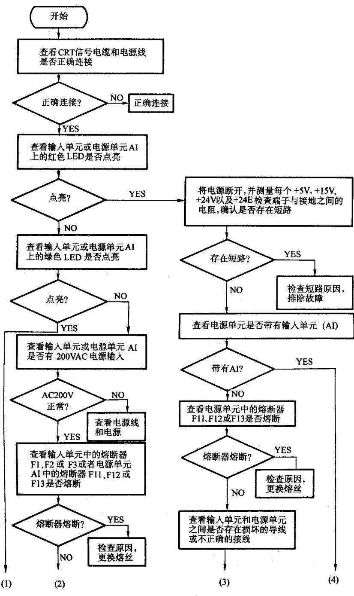  
图2-6系统无显示的故障诊断步骤

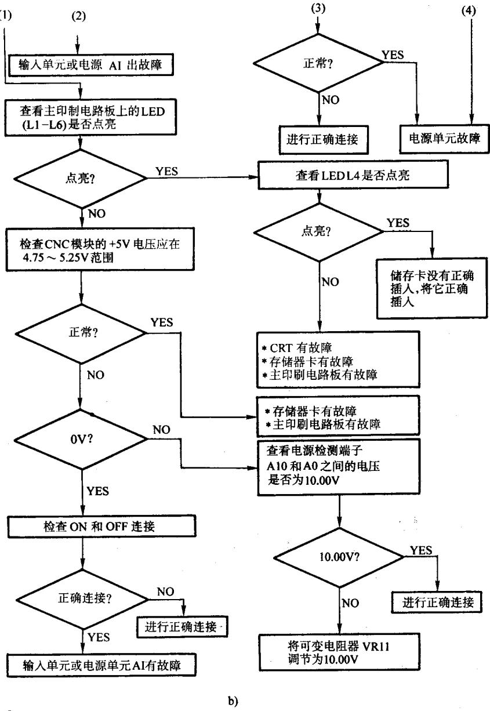  
图2-6系统无显示的故障诊断步骤(续）

对于系统天显示的故障诊断方法与具体故障的维修实例，详见本书第4 章第4.2节。

## 2.2.3不能进行手动的故障诊断

不能进行手动操作时，可以按图2-7步骤对系统进行检查，诊断无显示的原因：

上述检查步骤中，在不同的系统里，各检测信号、参数的地址是不同的，具体应参见系统生产厂家提供的数控系统连接说明书或相关的资料。

对于典型系统，本书第4章第4.5 节中列出了与手动操作有关的信号地址与相关参数一览表(表4-4)，可以供维修参考。不能进行手动操作的具体故障维修方法与维修实例，详见本书第4章第4.5节。

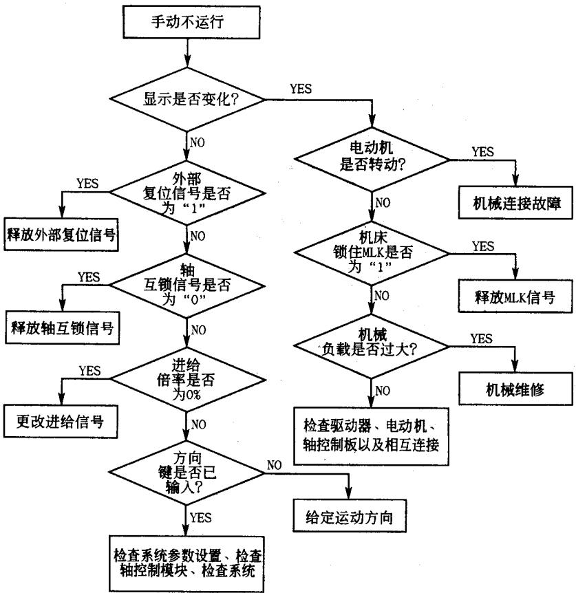  
图2-7不能进行手动操作的故障诊断步骤

## 2.2.4不能回参考点的故障诊断

数控机床回参考点操作是建立机床坐标系的前提，回参考点动作不正常包括回参考点动作不能进行与参考点位置不正确这两种情况，在维修过程中，这两种情况应区别对待，并根据不同的情况，分别按以下步骤对系统进行检查，诊断无显示的原因。

（1)回参考点不能进行的故障诊断回参考点不能进行故障是指机床不执行回参考点动作，或者是动作错误，或者是回参考点过程中系统出现报警的情况。这时，可以按图2-8的步骤对系统进行检查，诊断回参考点不能进行的原因。

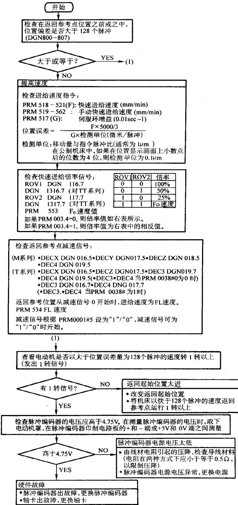  
图2-8回参考点不能进行的故障诊断步骤

图2-8检查步骤中，具体参数号与FSOC对应，在不同的系统里，各检测信号、参数的地址是不同的，具体应参见系统生产厂家提供的数控系统连接说明书或相关的资料。

当回参考点不能进行时，系统一般出现报警显示，一例如：在FANUCO系统中为ALM90、ALM91，在 FANUC 11 系统中为 PS200 等。有关回参考点不能进行的具体维修方法与维修实例，参见本书第4章第4.6节。

(2)回参考点位置不正确的故障诊断回参考点不正确故障是指机床可以执行回参考点动作，但是参考点定位位置出现错误的情况。这时，根据具体情况，可以按图2–9 的步骤对系统进行检查，诊断回参考点定位位置不正确的原因。

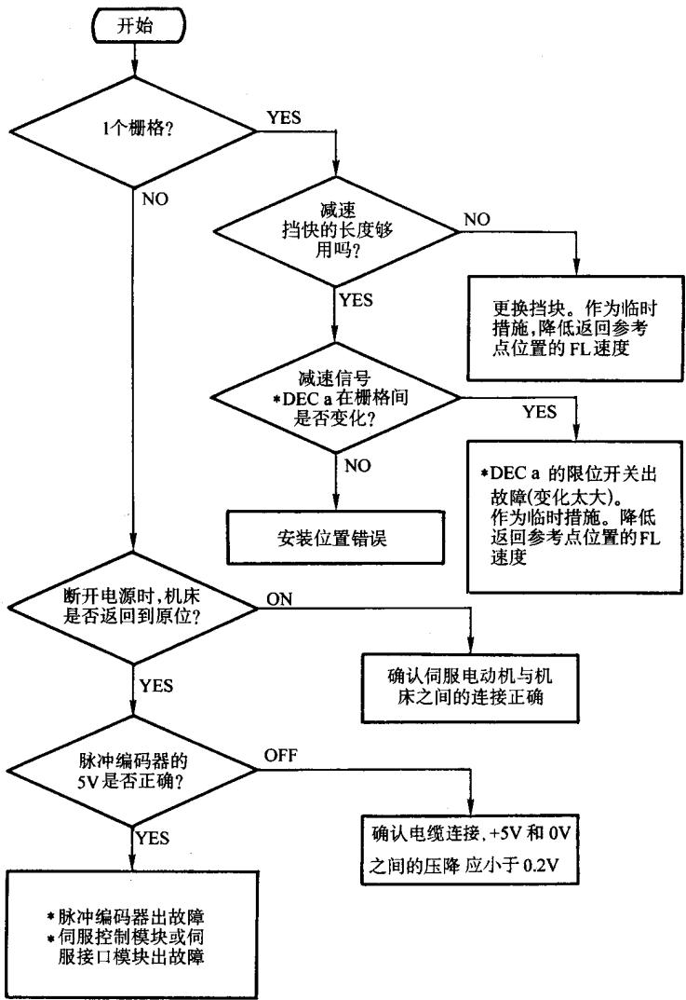  
图2-9回参考点位置不正确的故障诊断步骤

有关回参考点位置不正确的具体维修方法与维修实例，参见本书第4 章第 4.6 节。

## 2.2.5不能进行自动运行的故障诊断

系统不能自动运行是指系统可以进行手动操作，但不能进行程序的自动加工运行。故障包括自动加工程序不能起动与自动加工过程中出现加工中断这两种情况，当出现这种故障时，一般可以利用系统的“工作状态诊断”功能，通过对系统的诊断参数的检查，确定不能进行自动运行的原因。

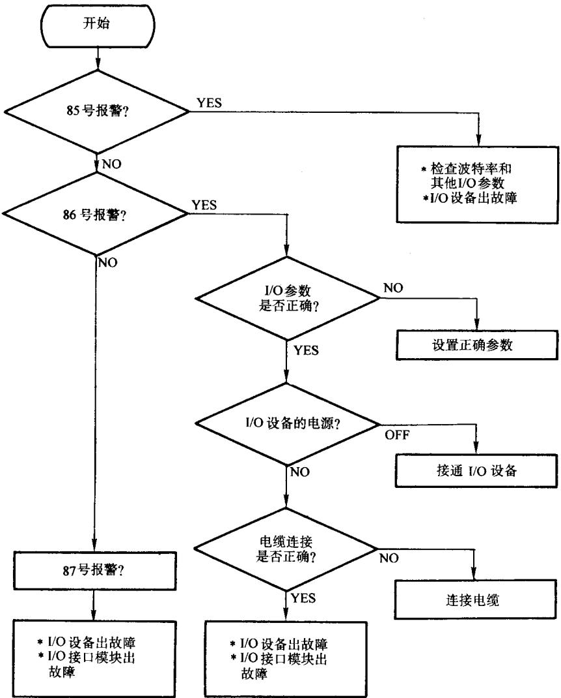  
图2-10系统I/0接口故障的诊断步骤

有关系统自诊断状态的含义以及检查方法详见第2.3 节;系统不能自动运行的故

障维修实例详见本书第4章第4.7节。

## 2.2.6系统 I/0接口故障的诊断

系统 I/O 接口故障是指示系统在与外部设备进行数据传输时，出现系统报警或数据不能进行正常传输的故障。当出现这种故障时，可以按上图2-10 的步骤对系统进行检查，诊断系统I/O接口故障的原因。

除以上常见的典型故障外，在实际机床维修过程系统中还有其他多种故障，如：驱动系统故障、主轴系统故障、数控系统本身故障、操作错误、参数设定错误、编程错误等等。这些故障通常在显示器上可以显示较明确的报警号与报警内容，其故障诊断方法应根据不同情况区别对待,在此不一一列举，具体参见本书各有关章节的故障维修实例的内容。

对于常见的FANUC 系统，本书附录1中列出了报警代码一览表，维修时可以参考。

## 2.3FANUC 系统的基本检查与测试

## 2.3.1系统常规检查

在维修数控机床时，为了保证机床安全、可靠的运行，不论故障是否与以下检查有关，通常情况下都应首先对数控系统作常规的检查与测试。这些检查包括外观检查与电源电压的确认两个方面。

## 1．系统的外观检查

（1)部件的外观检查数控装置与伺服驱动的外观检查应包括以下几个方面：

1)检查MDI/CRT单元、机床操作面板等单元的元器件外观有无破损。

2)检查控制单元、伺服驱动器、电源单元、I/O单元、PLC、电动机及编码器等单元的元器件有无不良；外形是否有破损、污染。

3)各连接电缆是否有破损、绝缘损坏或插接不良等。

## (2)安装检查

1)检查控制单元、伺服驱动器、电源单元、I/O单元、PLC等单元是否安装牢固，模块是否有松动、脱落现象。

2)检查面板上、机床上的操作元器件是否安装牢固。

3)检查连接电缆线是否按照要求布置、固定，电缆插头是否已经可靠固定。

4)检查各I/O连接端子的接线是否有松动，安装是否牢固等。

## (3)连接检查

1)检查系统、驱动的电源连接是否正确。

2)检查CNC、SV 驱动器、PLC、I/O单元的接地线连接是否正确，线径是否足够大，连接位置是否合理，保护地是否为单点接地。

3)检查信号电缆是否己经可靠、合理接地。

4)如果电缆线已经更换，则应检查更换的电缆线是否符合系统要求;屏蔽层是否已经可靠连接等。

## 2.电源电压的确认

作为系统的输入电压，应根据系统所使用电压的不同，满足系统安装、使用说明书规定的要求。一般来说，系统对于输入电压的基本要求如下：

（1)交流输人电压系统交流主回路与控制回路的电压：

AC380V输入：电压值： $3 8 0 ( \mathrm { l } \pm _ { 1 5 \% } ^ { 1 0 \% } ) \mathrm { V }$ ；频率： $( 5 0 \pm 1 ) _ { \mathrm { H z } } ,$

AC220V输入：电压值： $2 2 0 ^ { ( } 1 \pm _ { 1 5 \% } ^ { 1 0 \% } \mathrm { V } )$ ；频率： $( 5 0 \pm 1 ) _ { \mathrm { H z } } ,$

AC200V输入：电压值： $2 0 0 ( 1 \pm _ { 1 5 \% } ^ { 1 0 \% } ) \mathrm { V }$ ；频率：（50±1）Hz;

（2）FANUC系统各单元规定的交流输入电压控制单元的电源输入：AC200（1$\pm \ : _ { 1 5 \% } ^ { 1 0 \% } \ : ) \mathrm { V }$ ；频率： $( 5 0 \pm 1 ) \mathrm { H z } ;$ 或 $\mathrm { A C 2 2 0 ( 1 \pm _ { 1 5 \% } ^ { 1 0 \% } ) V ; ( 6 0 \pm 1 ) H z } ;$ 但不宜是 $\mathrm { A C 2 0 0 V / ( 6 0 \pm 1 ) }$ Hz;

伺服单元的电源输入： $\mathrm { A C 2 0 0 } ( 1 \pm _ { 1 5 } ^ { 1 0 \% } ) \mathrm { V }$ ；频率： $( 5 0 \pm 1 ) _ { \mathrm { H z } } ,$ 或 $\mathrm { A C 2 2 0 ( 1 \pm _ { 1 5 \% } ^ { 1 0 \% } ) V ; ( 6 0 \pm }$ 1)Hz;但不宜是 $\mathrm { A C 2 0 0 V / ( 6 0 \pm 1 ) H z }$ O

当使用FANUC标准电源变压器时，可以使用的输入电压为：

AC200V、220V、230V、240V、380V、415V、440V、450V、480V、550V（误差不超过+10%，-15%），系统输入电压应按照上述要求进行连接。

（3)直流输入电压DC24V输入：电压值： $2 4 ( 1 \pm 1 0 \% ) \mathrm { V }$ ：并经过符合要求的滤波处理。

在部分系统中，由于系统内部采用了开关稳压电源，因此允许输入电源有较大的允差。在这种前提下，对DC24V输入的要求为：

电压值： $2 4 ( 1 \pm _ { 2 0 \% } ^ { 1 5 \% } ) \mathrm { V }$ ；并经过符合要求的滤波处理。

(4)系统电源模块的输出电压系统电源模块的输出电压，主要是指供给系统内部各单元使用的各类电压，电压值必须保证正确。维修时应对其进行测量、检查，并通过

系统电源内部的相应调整元器件的调整，保证各电压值在允许范围内。在FANUC 系统中，常用的电压种类与要求如下：

1)系统逻辑电路用5V电压： $+ 5 ^ { ( } 1 \pm 5 \% ) \mathrm { V }$

2)系统输入、输出信号，显示器用24V电压： $+ 2 4 ( 1 \pm 1 0 \% ) \mathrm { V }$

3)系统外部输入、输出信号用24V电压： $+ 2 4 ( 1 \pm 1 0 \% ) \mathrm { V } .$

4)系统位置控制电路用+15V电压： $+ 1 5 ( 1 \pm 5 \% ) \mathrm { V } .$

5）系统位置控制电路用-15V电压： $- 1 5 ( 1 \pm 5 \% ) \mathrm { V }$

6)系统电源模块基准10V电压： $+ 1 0 ^ { ( } 1 \pm 0 . 5 \% ) \mathrm { V }$

## 2.3.2I/0信号状态检查

当系统发生故障时，首先需要判别故障发生的部位，即:初步确定故障发生在系统内部还是系统外部。当故障发生在系统外部时，还需要判别故障是由PLC 程序逻辑条件不满足或是机床侧的元器件故障引起的。在某些情况下，机床也可能因为系统处在等待外部信号输入的状态，而暂时无动作。为此，在维修时，应熟练掌握系统的自诊断技术，随时检查系统、PLC、机床的接口信号状态与系统的内部工作状态，以便判断故障原因。

在维修中，系统状态的检查包括接口信号诊断与系统状态诊断两个方面。在不同的数控系统中，状态诊断的内容与方法不尽相同，维修人员应根据机床的实际使用系统情况，对照有关说明书进行。

以FSO系统为例，表2-1列出了FSO系统主要接口信号与对应的诊断参数范围。对于数字I/O 信号，诊断参数的每一字节的相应位与对应的输入/输出状态—一对应，“1”代表信号接通，“0”代表信号断开。由此可见，通过检查诊断参数可以获得大量维修时所需要的信息。

表2-1FSO系统诊断参数一览表
<table><tr><td colspan="1" rowspan="1">诊断号</td><td colspan="1" rowspan="1">显示内容</td><td colspan="1" rowspan="1">备注</td></tr><tr><td colspan="1" rowspan="1">DGN000 ~ 022</td><td colspan="1" rowspan="1">直接来自机床的输入信号</td><td colspan="1" rowspan="1">在不带 PMC 的系统中，仅使用016~022</td></tr><tr><td colspan="1" rowspan="1">DGN027</td><td colspan="1" rowspan="1">位置编码器检测信号</td><td colspan="1" rowspan="1"></td></tr><tr><td colspan="1" rowspan="1">DGN048 ~ 053</td><td colspan="1" rowspan="1">直接向机床侧输出的信号</td><td colspan="1" rowspan="1"></td></tr><tr><td colspan="1" rowspan="1">DGN080~ 089</td><td colspan="1" rowspan="1">直接向机床侧输出的信号</td><td colspan="1" rowspan="1">在不带PMC的系统中不能使用</td></tr><tr><td colspan="1" rowspan="1">DGN100~ 131</td><td colspan="1" rowspan="1">由PMC（机床）到CNC的信号</td><td colspan="1" rowspan="1">在不带PMC的系统中，仅使用116～122</td></tr><tr><td colspan="1" rowspan="1">DGN148 ~ 178</td><td colspan="1" rowspan="1">由CNC到PMC（机床）的信号</td><td colspan="1" rowspan="1">在不带PMC的系统中，仅使用148～153</td></tr><tr><td colspan="1" rowspan="1">DGN700</td><td colspan="1" rowspan="1">自动运行时，CNC停止状态信号</td><td colspan="1" rowspan="1"></td></tr><tr><td colspan="1" rowspan="1">DGN701</td><td colspan="1" rowspan="1">自动运行时，CNC停止状态信号</td><td colspan="1" rowspan="1"></td></tr><tr><td colspan="1" rowspan="1">DGN712</td><td colspan="1" rowspan="1">自动运行停/暂停状态信号</td><td colspan="1" rowspan="1"></td></tr><tr><td colspan="1" rowspan="1">DGN720~723</td><td colspan="1" rowspan="1">伺服系统报警状态信息</td><td colspan="1" rowspan="1"></td></tr><tr><td colspan="1" rowspan="1">DGN760 ~ 763</td><td colspan="1" rowspan="1">绝对编码器状态检测信息</td><td colspan="1" rowspan="1">（仅在使用绝对编码器时用）</td></tr><tr><td colspan="1" rowspan="1">DGN770~773</td><td colspan="1" rowspan="1">绝对编码器状态检测信息</td><td colspan="1" rowspan="1">（仅在使用绝对编码器时用）</td></tr><tr><td colspan="1" rowspan="1">DGN800~ 803</td><td colspan="1" rowspan="1">坐标轴位置跟随误差</td><td colspan="1" rowspan="1"></td></tr><tr><td colspan="1" rowspan="1">DGN820~ 823</td><td colspan="1" rowspan="1">各轴在机床坐标系上的绝对位置</td><td colspan="1" rowspan="1"></td></tr></table>

## 1．I/0信号的构成

通过I/O 信号的状态诊断，确定故障部位和分析故障原因是维修时用得最多的方法之一。I/O信号的数量与构成，在不同的系统中有所不同。对于FANUC系列数控系统，根据系统的功能与结构，可以分为不带内部 PMC与带内部 PMC(PLC)两种形式。

不带内部 PMC 的数控系统的I/O 信号特点是:不论系统功能、I/O 单元如何，各输入、输出信号的作用和地址总是固定不变的。如对于FS0系统：输入X016.5总是X轴参考点减速信号（\*DECX);输出Y048.0 总是X轴参考点到达信号等等。此外，在不带内部 PMC 的系统中，也没有CNC与PMC 间的信号转换过程，对应的输入、输出信号与CNC 侧的内部信号一一对应。如：从机床（或操作面板）到系统的输入信号X016.2（+X方向键)的状态与 CNC 内部信号 G116.2 的状态完全相同;输出到机床(或操作面板)X轴参考点到达信号Y048.0，与CNC 内部信号F148.0 的状态完全相同等等。

在带内部 PMC 的数控系统中，根据所选用的系统、内部 PMC 类型、I/O单元的不同，其信号的数量有所不同。除少量输入、输出信号的作用和地址固定不变外，大部分输入、输出信号的作用和意义，在不同的机床上有不同的含义，维修时必须参照机床的电气原理图与PLC程序进行检查。

以FSOC 数控系统为例，不带内部 PMC 的系统，I/O 接口信号的构成如图2-11 所示。

图中X016.0\~X022.7是从机床(或操作面板)到系统的输入信号;Y048.0\~Y053.7是从系统到机床(或操作面板)的输出信号。它们与系统诊断数据 DGN016.0～022.7、DGN048.0\~053.7一一对应;并且与DGN116.0\~122.7、DGN148.0\~53.7状态完全相同。

带内部 PMC 的数控系统，I/0 接口状态与信号构成如图2-12 所示。图2-12中，

X016.0\~X022.7,X000.0\~X008.7，X010.0\~X014.7是从机床(或操作面板)到系统的输入信号；Y048.0\~Y053.7，Y080.0\~Y082.7，Y084.0\~Y086.7是从系统到机床（或操作面板)的输出信号。它们与系统诊断数据 DGN016.0\~022.7, DGN000.0\~008.7, DGN010.0\~014.7, DGN048.0\~ 053.7, DGN080.0\~ 082.7, DGN084.0\~ 086.7一一对应。而 G100.0\~G131.7则是从 PMC 输出到 CNC 的内部信号（PMC 输出）， F148.0～F178.7是从CNC输入到 PMC 的内部信号（PMC 输入)，它们分别与系统诊断数据 DNG100.0\~DNG131.7，DNG148.0\~DNG148.7一一对应。在这种情况下，DNG16.2 与 DNG116.2 可能具有完全不同的含义，前者代表来自机床侧的输入信号X16.2，后者代表由 PMC 输出到 CNC 的内部信号G116.2，其作用与意义有本质区别。

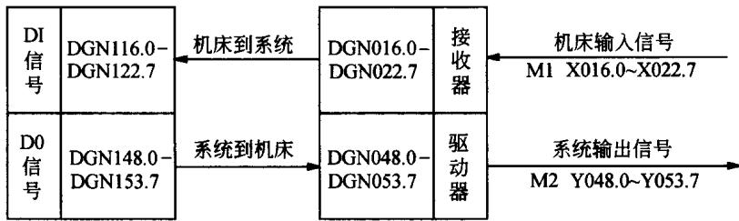

图2-11不带 PMC的I/0接口信号构成  
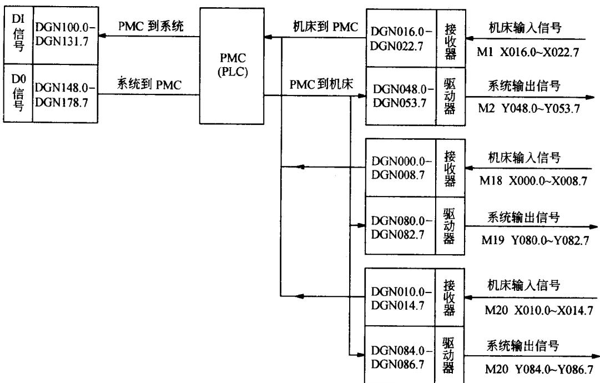  
图2-12带PMC的I/O接口信号构成

当系统采用了附加I/0单元B2 时，增加的输入信号X1000.0\~X1012.7 也是从机床（或操作面板）到系统的输入信号;输出信号Y1020.0\~Y1028.7是从系统到机床（或操作面板)的输出信号。

## 2.FANUC 系统 I/O 信号状态的显示与输出模拟

在FANUC 系统中，通过系统的MDI/CRT面板检查、诊断的接口信号状态，实质上是输入、输出缓冲存储器的内容，当系统与外部信号连接的接口电路（如输入接收器或输出驱动器)发生故障时，诊断信号的状态将与实际输入、输出不同。为了方便维修与调试,部分系统还可以通过修改输入、输出缓冲存储器的内容，对外部信号进行模拟输入/输出。

系统的状态诊断操作，在不同的数控系统中有所不同，维修时可以参考数控系统的维修说明书进行。由于状态诊断是维修数控机床的重要手段，现将常用系统的状态诊断操作步骤介绍如下：

## (1)FS0/6 输入/输出信号的状态诊断

1)按系统 MDI/CRT 操作面板上的DGNOS键，系统显示诊断页面。

2)按系统MDI/CRT 操作面板上的PAGE键（换页)或CURSOR（光标移动键），可以逐页显示诊断信号的状态。

3)在系统显示诊断页面时，亦可以通过输入诊断地址及INPUT 键，直接搜索所需要的诊断页面。

## (2)FS11输入/输出信号的状态诊断

1)在系统显示“机能选择”页面时，按下系统MDI/CRT的软功能键SERVIC，显示系统维修页面(“机能选择”页面可以通过面板上的“机能"菜单键直接进入)。

2)按系统 MDI/CRT的软功能键CHAPTER，使显示器出现较功能键DGNOS。

3)按系统 MDI/CRT 的软功能键 DGNOS 键，显示诊断页面;或通过多次操作软功能键SERVICE，亦可以显示诊断页面。

4)按系统MDI/CRT操作面板上的RAGE键（换页）或CURSOR（光标移动键），可以逐页显示诊断信号的状态;或按操作菜单键，切换到操作选择页面，按下软功能键INP-NO进入操作引导方式;在面板上用地址与数字键，输入诊断地址后，按EXEC键，可以直接搜索所需要的诊断参数。

(3)FS15的输入/输出信号的状态诊断

1)按 MDI/CRT 面板上的[CNC/PMC]键。

2)按 MDI/CRT 面板上的[PCDGN]软功能键。

3)用MDI 面板的地址与数字键输入诊断地址（如:X100)后，按[SEARCH]软功能键，

直接检索，显示所需要的诊断参数。

4)按系统MDI/CRT面板上的换页键，亦可逐页诊断信号的状态。

（4)FS Oi/PMO/16/18输入/输出信号的状态诊断

1)按系统 MDI/DPL操作面板上的YSTEM键，显示系统页面。

2)按系统 MDI/DPL 操作面板上的DGNOS/PARAM键，显示诊断页面。

3)用MDI面板的地址与数字键输入诊断地址后，按NO 检索键，直接搜索所需要的诊断参数。

4)按系统MDI/CRT操作面板上的PAGE键（换页)或CUROR（光标移动键），也可以逐页显示诊断信号的状态。

(5)输出信号的模拟发送在部分FANUC系统中，在PLC停止程序运行时，还可以通过修改输入、输出缓冲存储器的内容，对外部信号进行模拟输出。以 FSO 为例，其操作步骤如下：

1)选择MDI操作方式或使系统进入“紧停”状态。

2)打开系统的“程序保护”开关。

3)按系统 MDI/DPL 操作面板上的OFFSET/SETTING键，系统显示偏置/设定页面。

4)按系统 MDI/DPL 操作面板上的SETTING软功能键，选择设定页面。

5)按系统 MDI/DPL操作面板上的数字键，输入参数 PWE☆1，使参数写入“使能”。

6)按系统MDI/CRT操作面板上的DGNOS键，系统显示诊断页面。

7)按系统MDI/CRT 操作面板上的PAGE键（换页），显示输出诊断信号所在的页面。

8)按CURSOR（光标移动键），或通过输入诊断地址及INPUT键，将光标移动到需要输出的信号下。

9)按系统 MDI/CRT操作面板上的数字键，输入诊断数据。

10)按 INPUT键或START 键，系统向输出端发送外部模拟输出信号。

由于输出信号的模拟发送直接控制了机床的动作，因此这一操作要在对机床的机械结构，特别是动作的“互锁”条件十分了解的前提下，才能进行以上操作；此外，PMC的工作也必须处于停止状态，因此，本方法通常只能在机床首次调试时使用，维修人员如无十分把握，最好还是使用手动操作电磁元器件等措施，进行输出信号的模拟控制。

## 2.3.3NC的工作状态诊断

通过系统的显示面板，除可以检查、诊断 I/O 接口信号的状态外，还可以检查系统的实际工作状态。在FANUC系统中包括以下几个方面。

## 1．自动运行停止的状态诊断

当机床在自动工作方式下，系统无报警，“循环起动”指示灯亮，但机床却没有动作（即出现所谓的“死机”）)时，可以借助这些信息，观察系统的停机原因。在常用的FANUC系统中，对应的诊断参数及含义如下：

（1）FS0/6诊断参数地址及意义在FS0/6系统中，自动运行停止诊断参数号为DGN700、701，对应位的信号分别见表2-2和表2-3。

表2-2
<table><tr><td rowspan=1 colspan=1>DGN700</td><td rowspan=1 colspan=1>bit7</td><td rowspan=1 colspan=1>bit6</td><td rowspan=1 colspan=1>bit5</td><td rowspan=1 colspan=1>bit4</td><td rowspan=1 colspan=1>bit3</td><td rowspan=1 colspan=1>bit2</td><td rowspan=1 colspan=1>bit1</td><td rowspan=1 colspan=1>bit0</td></tr><tr><td rowspan=1 colspan=1>代号</td><td rowspan=1 colspan=1></td><td rowspan=1 colspan=1>CSCT</td><td rowspan=1 colspan=1>CITL</td><td rowspan=1 colspan=1>COVZ</td><td rowspan=1 colspan=1>CINP</td><td rowspan=1 colspan=1>CDWL</td><td rowspan=1 colspan=1>CMTN</td><td rowspan=1 colspan=1>CFIN</td></tr></table>

表2-3
<table><tr><td rowspan=1 colspan=1>DGN701</td><td rowspan=1 colspan=1>bit7</td><td rowspan=1 colspan=1>bit6</td><td rowspan=1 colspan=1>bit5</td><td rowspan=1 colspan=1>bit4</td><td rowspan=1 colspan=1>bit3</td><td rowspan=1 colspan=1>bit2</td><td rowspan=1 colspan=1>bit1</td><td rowspan=1 colspan=1>bit0</td></tr><tr><td rowspan=1 colspan=1>代号</td><td rowspan=1 colspan=1>CRST</td><td rowspan=1 colspan=1></td><td rowspan=1 colspan=1>CRST</td><td rowspan=1 colspan=1></td><td rowspan=1 colspan=1></td><td rowspan=1 colspan=1></td><td rowspan=1 colspan=1>CTRD</td><td rowspan=1 colspan=1>CTPD</td></tr></table>

当DGN700、701对应位状态为“1”时，代表的意义如下：

CSCT:等待主轴转速到达信号；

CITL：轴互锁信号接通；

COVZ:进给信率为0%；

CINP:进行到位检测；

CDWL:暂停指令执行中；

CMTN：运动指令执行中；

CFIN：M、S、T指令执行中。

CRST：外部复位生效、复位按钮接通、复位与倒带信号生效；

CTRD:纸带阅读机接口的数据输入中；

CTPU:纸带阅读机接口的数据输出中。

（2)FS11诊断参数地址及意义在FS11系统中，自动运行停止诊断参数号为DGN1000、DGN1001，对应位状态为“1"时代表的意义如下：

DGN1000:

bitO:进行到位检测；

bit1:进给速度倍率为0%；

bit2:手动进给速度信率为0%；

bit3:轴互锁信号接通或起动互锁信号接通；

bit4:等待主轴转速到达信号；

bit5:等待主轴零脉冲信号（螺纹加工时用）；

bit6:等待主轴位置信号（主轴每转进给用）；

bit7:纸带读入中。

DGN1001:

bit0:后台编辑纸带读入中。

（3)FS 15/150 诊断参数地址及意义在FANUC 15/150系统中，CNC作状态诊断与PLC 状态诊断在不同的区域，它可以通过如下操作进入CNC 作状态诊断页面：

1)按MDI/CRT操作面板上的“机能选择”软功能键，进入系统的机能显示页面。

2)按SERVICE软功能键，进入维修页面。

3)通过MDI上的数字键输入诊断参数号（如： 1000)，按软功能键INP-NO可显示诊断数据 DGN1000 的状态。

4)在维修页面下，亦可通过按多次“选页”键，使诊断参数逐页显示检索所需的诊断页面。

通过诊断参数DGN1000、DGN1001，可以显示自动方式下、系统无报警、“循环起动”指示灯亮、但机床没有动作的原因。DGN1000、DGN1001各对应位状态显示为“1”时的含义如下：

DGN1000:

bito:进行到位检测；

bitl:进给速度倍率为0%；

bit2:手动进给速度倍率为0%；

bit3:轴互锁信号或起动互锁信号接通；

bit4:等待主轴转速到达信号；

bit5:等待主轴零脉冲信号；

bit6:等待主轴位置信号；

bit7:纸带读入中。

DGN1001:

bito:后台编辑纸带读入中。

(4)FS0i/PMO/16/18诊断参数地址及意义

在FANUC 0i/PM0/16/18系统中，可以直接通过诊断参数 DGN000 至DGN016 显示自动运行状态，这些信息指示了系统在执行自动指令时所处的状态。

在图2-13 所示的页面中，每一行右边的状态显示为“1”时，实际系统的内部工作状态如表2-4所示。

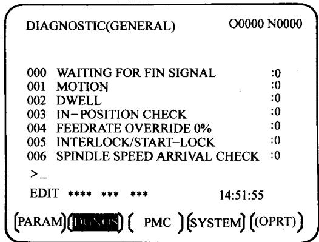  
图2-13FANUCOi/PMO自动运行诊断显示

表2-4FANUC Oi/PM0/16/18系统内部工作状态显示
<table><tr><td rowspan=1 colspan=1>诊断号</td><td rowspan=1 colspan=1>显示</td><td rowspan=1 colspan=1>当显示为1时的内部状态</td></tr><tr><td rowspan=1 colspan=1>000</td><td rowspan=1 colspan=1>WAITING FOR FIN SINGAL</td><td rowspan=1 colspan=1>正在执行M.S.T功能</td></tr><tr><td rowspan=1 colspan=1>001</td><td rowspan=1 colspan=1>MOTION</td><td rowspan=1 colspan=1>在自动运行过程中正在执行移动命令</td></tr><tr><td rowspan=1 colspan=1>002</td><td rowspan=1 colspan=1>DWELL</td><td rowspan=1 colspan=1>正在执行停止命令</td></tr><tr><td rowspan=1 colspan=1>003</td><td rowspan=1 colspan=1>IN – POSITION CHECK</td><td rowspan=1 colspan=1>正在执行到位检测</td></tr><tr><td rowspan=1 colspan=1>004</td><td rowspan=1 colspan=1>FEEDRATE OVERRIDE0%</td><td rowspan=1 colspan=1>切削进给倍率0%</td></tr><tr><td rowspan=1 colspan=1>005</td><td rowspan=1 colspan=1>INTERLOCK SIART – LOCK</td><td rowspan=1 colspan=1>互锁</td></tr><tr><td rowspan=1 colspan=1>006</td><td rowspan=1 colspan=1>SPINDLE SPEED ARRIVAL CHECK</td><td rowspan=1 colspan=1>等待主轴速度达到信号接通</td></tr><tr><td rowspan=1 colspan=1>010</td><td rowspan=1 colspan=1>RUNCHING</td><td rowspan=1 colspan=1>通过阅读/穿孔接口输出数据</td></tr><tr><td rowspan=1 colspan=1>001</td><td rowspan=1 colspan=1>READING</td><td rowspan=1 colspan=1>通过阅读/穿孔接口输入数据</td></tr><tr><td rowspan=1 colspan=1>012</td><td rowspan=1 colspan=1>WAITING FOR( UN)CLAMP</td><td rowspan=1 colspan=1>B轴分度工作台操作前等待分度工作台的夹紧或松开</td></tr><tr><td rowspan=1 colspan=1>013</td><td rowspan=1 colspan=1>JOG FEEDRATE OVERRIDE0%</td><td rowspan=1 colspan=1>JOG 进给倍率0%</td></tr><tr><td rowspan=1 colspan=1>014</td><td rowspan=1 colspan=1>WAITING FOR RESET.ESP. RRW. OFF</td><td rowspan=1 colspan=1>急停，外部复位，复位&amp;倒带，或者MDI上的复位健接通。</td></tr><tr><td rowspan=1 colspan=1>015</td><td rowspan=1 colspan=1>EXTERNAL PROGRAM NUMBER SEARCH</td><td rowspan=1 colspan=1>外部程序号检索</td></tr><tr><td rowspan=1 colspan=1>016</td><td rowspan=1 colspan=1>BACKGROUND ACTIVE</td><td rowspan=1 colspan=1>后台编辑进行中</td></tr></table>

## 2.不能自动运行的状态诊断

当机床在自动工作方式下，系统无报警，“循环起动”指示灯不亮，机床不能执行自动加工程序；或自动加工出现加工中断时，可以借助这些信息，观察故障的原因。

## （1)FS0/6诊断参数地址及意义

在 FSO/6 系统中，当自动操作方式下的加工过程出现停止时。诊断参数 DGN712 的信息指示了自动加工中断，以及“循环起动”灯(STL)关闭可能的原因(如下表)。

<table><tr><td rowspan=1 colspan=1>DGN 712</td><td rowspan=1 colspan=1>bit7</td><td rowspan=1 colspan=1>bit6</td><td rowspan=1 colspan=1>bit5</td><td rowspan=1 colspan=1>bit4</td><td rowspan=1 colspan=1>bit3</td><td rowspan=1 colspan=1>bit2</td><td rowspan=1 colspan=1>bit1</td><td rowspan=1 colspan=1>bit0</td></tr><tr><td rowspan=1 colspan=1>代号</td><td rowspan=1 colspan=1>STP</td><td rowspan=1 colspan=1>REST</td><td rowspan=1 colspan=1>EMS</td><td rowspan=1 colspan=1>RRWD</td><td rowspan=1 colspan=1>RSTB</td><td rowspan=1 colspan=1></td><td rowspan=1 colspan=1></td><td rowspan=1 colspan=1>CSU</td></tr></table>

注意:DGN712 的状态应在故障发生后即进行检查，若故障发生后系统电源被切断，当电源再次接通时，DGN712所有位将被清零。

通过各诊断数据的状态组合，可以分析、确定系统实际所处的状态，这些状态的含义见表2-5。

表2-5FS0/6自动运行停止状态表
<table><tr><td rowspan=1 colspan=1>bit7</td><td rowspan=1 colspan=1>bit6</td><td rowspan=1 colspan=1>bit5</td><td rowspan=1 colspan=1>bit4</td><td rowspan=1 colspan=1>bit3</td><td rowspan=1 colspan=1>bit2</td><td rowspan=1 colspan=1>bittl</td><td rowspan=1 colspan=1>bit0</td><td rowspan=1 colspan=1>原因</td></tr><tr><td rowspan=1 colspan=1>1</td><td rowspan=1 colspan=1>1</td><td rowspan=1 colspan=1>1</td><td rowspan=1 colspan=1>0</td><td rowspan=1 colspan=1>0</td><td rowspan=1 colspan=1>0</td><td rowspan=1 colspan=1>0</td><td rowspan=1 colspan=1>1</td><td rowspan=1 colspan=1>输入了紧急停止信号*ESP</td></tr><tr><td rowspan=1 colspan=1>1</td><td rowspan=1 colspan=1>1</td><td rowspan=1 colspan=1>1</td><td rowspan=1 colspan=1>0</td><td rowspan=1 colspan=1>0</td><td rowspan=1 colspan=1>0</td><td rowspan=1 colspan=1>0</td><td rowspan=1 colspan=1>0</td><td rowspan=1 colspan=1>输入了外部复位 ERS信号</td></tr><tr><td rowspan=1 colspan=1>1</td><td rowspan=1 colspan=1>1</td><td rowspan=1 colspan=1>0</td><td rowspan=1 colspan=1>1</td><td rowspan=1 colspan=1>0</td><td rowspan=1 colspan=1>0</td><td rowspan=1 colspan=1>0</td><td rowspan=1 colspan=1>0</td><td rowspan=1 colspan=1>输入了复位&amp;倒带RRW信号</td></tr><tr><td rowspan=1 colspan=1>1</td><td rowspan=1 colspan=1>1</td><td rowspan=1 colspan=1>0</td><td rowspan=1 colspan=1>0</td><td rowspan=1 colspan=1>1</td><td rowspan=1 colspan=1>0</td><td rowspan=1 colspan=1>0</td><td rowspan=1 colspan=1>0</td><td rowspan=1 colspan=1>按下了MDI复位按钮</td></tr><tr><td rowspan=1 colspan=1>1</td><td rowspan=1 colspan=1>0</td><td rowspan=1 colspan=1>0</td><td rowspan=1 colspan=1>0</td><td rowspan=1 colspan=1>0</td><td rowspan=1 colspan=1>0</td><td rowspan=1 colspan=1>0</td><td rowspan=1 colspan=1>1</td><td rowspan=1 colspan=1>发生伺服报警</td></tr><tr><td rowspan=1 colspan=1>1</td><td rowspan=1 colspan=1>0</td><td rowspan=1 colspan=1>0</td><td rowspan=1 colspan=1>0</td><td rowspan=1 colspan=1>0</td><td rowspan=1 colspan=1>0</td><td rowspan=1 colspan=1>0</td><td rowspan=1 colspan=1>0</td><td rowspan=1 colspan=1>输入了进给暂停*SP信号或选择任一种手动方式</td></tr><tr><td rowspan=1 colspan=1>0</td><td rowspan=1 colspan=1>0</td><td rowspan=1 colspan=1>0</td><td rowspan=1 colspan=1>0</td><td rowspan=1 colspan=1>0</td><td rowspan=1 colspan=1>0</td><td rowspan=1 colspan=1>0</td><td rowspan=1 colspan=1>0</td><td rowspan=1 colspan=1>机床在单程序段处停机</td></tr></table>

（2)FS11诊断参数地址及意义在FS11系统中，当自动操作方式下的加工过程出现停止时，诊断参数DGN1010的信息指示了由于“复位”信号引起“循环起动”灯（STL)关闭的原因，DGN1010对应位为“1”的含义如下：

<table><tr><td rowspan=1 colspan=1>DGN712</td><td rowspan=1 colspan=1>bit7</td><td rowspan=1 colspan=1>bit6</td><td rowspan=1 colspan=1>bit5</td><td rowspan=1 colspan=1>bit4</td><td rowspan=1 colspan=1>bit3</td><td rowspan=1 colspan=1>bit2</td><td rowspan=1 colspan=1>bit1</td><td rowspan=1 colspan=1>bit0</td></tr><tr><td rowspan=1 colspan=1>代号</td><td rowspan=1 colspan=1></td><td rowspan=1 colspan=1></td><td rowspan=1 colspan=1></td><td rowspan=1 colspan=1></td><td rowspan=1 colspan=1>RST</td><td rowspan=1 colspan=1>ERS</td><td rowspan=1 colspan=1>RRW</td><td rowspan=1 colspan=1>ESP</td></tr></table>

ESP:紧停状态；

RRW:输入了复位或倒带信号；

ERS:外部复位信号接通；

RST:系统复位键生效。

（3)FS15诊断参数地址及意义在FS15系统中，当自动运行方式下的加工出现停止时，诊断参数DGN1005～DGN1010的信息指示了自动加工中断，以及“循环起动”灯（STL)关闭可能的原因。诊断参数的显示操作方式同前述，对应位为“1”时的含义如下：

DGN1005:

bit0:在MDI方式下，DI或DO信号无效；

bit1:在重新定位（REPOS)方式下，DI或DO无效；

bit2：由于其他原因引起的加工中断。

DGN1006:

bit0:系统的自动运行停止信号（★P)生效；

bitl:系统存在报警；

bit2:系统的程序重新起动信号（SRN）为“1”；

bit3:所选择的程序在后台编辑中；

bit4:外部设备未准备好；

bit5:MDI未执行完成；

bit6:系统的刀具取消信号（TRESC)生效；

bit7:系统不允许反向执行程序。

DGN1007:

bitO:外部报警信息；

bit2:系统出现P/S报警；

bit4:伺服报警；

bit5:I/0报警：

bit6:修改了需要关机生效的参数；

bit7:系统出错。

DGN1008:

bitO:后台编辑出现P/S报警；

bit1:程序编辑出现P/S报警；

bit2:系统过热；

bit3:子CPU 出错；

bit4:同步出错；

bit5:参数写入开关被打开；

bit6:超程/外部数据输入、输出出错；

bit7:PMC 出错。

DGN1009:

bit0:系统处于警告状态。

DGN1010:

bit0:系统紧停信号生效；

bit1:复位和反绕信号生效；

bit2:外部复位信号生效；

bit3:面板上的复位键生效。

（4)FSOi/PMO/16/18诊断参数地址及意义在FANUCoi/PMO系统中，可以直接通过诊断参数 DGN020 到 DGN025 进行自动运行停止状态的显示，这些信息指示了系统不执行自动加工程序的原因。

表2-6 列出了诊断参数DGN020 到DGN025右边的状态显示为“1"时，实际系统所处的内部工作状态。

通过表2-6的各诊断数据的状态组合，可以分析、确定系统实际所处的状态，这些状态的含义如图2-14所示。

表2-6系统内部工作状态显示
<table><tr><td>诊断号</td><td>显示</td><td>当显示为1时的内部状态</td></tr><tr><td>020</td><td>CUT SPEED UP/DOWN</td><td>发生急停或者发生伺服报警</td></tr><tr><td>021</td><td>RESET BUTTON ON</td><td>复位键信号接通</td></tr><tr><td>022</td><td>RESET AND REWIND ON</td><td>复位和倒带信号接通 急停</td></tr><tr><td>023 024</td><td>EMERGENCY STOP ON RESET ON</td><td>外部复位，急停</td></tr><tr><td>025</td><td>STOP MOTION OR DWELL</td><td>停止脉冲分配的标志，在下列情况时设置： 外部复位信号接通 复位/倒带键接通 急停 进给暂停 MDI 面板的复位键接通 手动方式（JOG/HANDLE/INC） 其他报警发生时 （未被设置的报警）</td></tr></table>

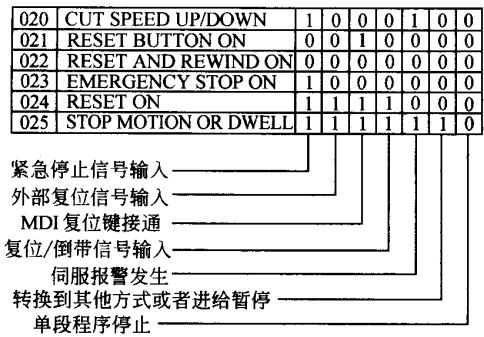  
图2-14诊断数据的状态组合

## 3.坐标轴的位置跟随误差检测

坐标轴的位置跟随误差是坐标轴指令位置与实际位置间的差值，在数控机床上，它亦反映了系统的动态跟随精度与静态定位精度。这是在维修过程中，需要特别引起注意的重要参数。在不同的FANUC 系统中，各坐标轴跟随误差的诊断参数号如下：

(1)FSO/6诊断参数地址

DGN800:X轴位置跟随误差；

DGN801:Y轴位置跟随误差；

DGN802:Z轴位置跟随误差；

DGN803:4 轴位置跟随误差。

（2)FS11/NS15诊断参数地址

DGN3000:与轴选择对应，为X、Y、Z、4、5轴位置跟随误差。

（3)FS0i/PM0/16/18诊断参数地址

DGN300:与轴选择对应，为X、Y、Z、4、5轴位置跟随误差。

除以上系统状态诊断信号外，FANUC 系统还可以对各轴伺服驱动器以及编码器的各种报警信号进行诊断，以确定故障的原因，有关这方面的内容参见本书第5 章第5.2.3节。

## 2.4CNC 模块的状态显示与故障诊断

当数控系统发生报警时，通常情况下可以在系统显示器上显示报警号与报警内容，但如果与显示功能有关的部分发生故障时，显示就无法进行，这时必须依靠系统主权或其他部分的指示灯（LED)的状态，进行故障分析、诊断与维修。

在不同的系统中，系统主板的状态指示有不同的含义，维修时应根据系统的不同区别对待。对于常见系统，主板的状态指示含义如下述。

## 2.4.1FANUC6 系统主板的状态显示与故障诊断

FANUC6系统主板上有五个LED作为系统错误状态指示，其含义如下：

1)WDALM：当系统主板上的WDALM 指示灯亮时，为系统监控报警。

引起此报警原因一般为系统RAM出错，或者是系统功能参数（PRM000～055、PRM300～304)设定错误。当出现以上故障时，在某些场合，一般可以通过 RAM 的初始

化操作进行清除。

2)LED0～3:指示系统错误，其状态显示见表2-7。

表2-7FS6系统错误状态显示
<table><tr><td rowspan=1 colspan=1>LED 状态3210</td><td rowspan=1 colspan=1>报警内容</td><td rowspan=1 colspan=1>备注</td></tr><tr><td rowspan=1 colspan=1>●•</td><td rowspan=1 colspan=1>正常，无报警</td><td rowspan=1 colspan=1></td></tr><tr><td rowspan=1 colspan=1>●●¤</td><td rowspan=1 colspan=1>系统连接单元、主板、MDI/CRT等连接不良</td><td rowspan=1 colspan=1>检查连接</td></tr><tr><td rowspan=1 colspan=1>●🌸●</td><td rowspan=1 colspan=1>系统发生900~999报警（除910、911外）</td><td rowspan=1 colspan=1>详见报警一览表</td></tr><tr><td rowspan=1 colspan=1>●</td><td rowspan=1 colspan=1>系统发生RAM奇偶报警</td><td rowspan=1 colspan=1></td></tr><tr><td rowspan=1 colspan=1>¤●●</td><td rowspan=1 colspan=1>0号RAM出错</td><td rowspan=1 colspan=1></td></tr><tr><td rowspan=1 colspan=1>¤●●¤</td><td rowspan=1 colspan=1>1号RAM出错</td><td rowspan=1 colspan=1></td></tr><tr><td rowspan=1 colspan=1>¤●¤●</td><td rowspan=1 colspan=1>2号RAM出错</td><td rowspan=1 colspan=1></td></tr><tr><td rowspan=1 colspan=1>¤●¤¤</td><td rowspan=1 colspan=1>3号RAM出错</td><td rowspan=1 colspan=1></td></tr><tr><td rowspan=1 colspan=1>¤¤●</td><td rowspan=1 colspan=1>4号RAM出错</td><td rowspan=1 colspan=1></td></tr><tr><td rowspan=1 colspan=1>¤¤●a</td><td rowspan=1 colspan=1>5号RAM出错</td><td rowspan=1 colspan=1></td></tr><tr><td rowspan=1 colspan=1>¤a¤●</td><td rowspan=1 colspan=1>6号RAM出错</td><td rowspan=1 colspan=1></td></tr><tr><td rowspan=1 colspan=1>¤¤¤a</td><td rowspan=1 colspan=1>7号RAM出错</td><td rowspan=1 colspan=1></td></tr><tr><td rowspan=1 colspan=1>¤●☆</td><td rowspan=1 colspan=1>8号RAM出错</td><td rowspan=1 colspan=1></td></tr><tr><td rowspan=1 colspan=1>¤●☆●</td><td rowspan=1 colspan=1>9号RAM出错</td><td rowspan=1 colspan=1></td></tr><tr><td rowspan=1 colspan=1>☆●</td><td rowspan=1 colspan=1>10号RAM出错</td><td rowspan=1 colspan=1></td></tr></table>

●：LED不亮；¤：LED亮；☆：LED闪烁。

注意：在FANUC 6 系统中，还可以通过RAM 测试操作，检测故障的 RAM号。RAM测试的操作步骤如下：

1)确认系统RAM故障。

2)同时按住“-”与“.”，同时起动系统。

IL – MODE1、TAPE2、MEMORY3、ENPANE4、BUBBLE5、PC—LOAD6、RAM TEST

4)按数字键6，进入RAM测试状态。

5)按 STAR键，进行RAMO测试。

6)再次按 START键，进行RAMI 测试。

7)重复按 START键，完成对全部（RAM0\~RAM410)的测试，测试结果状态与故障的RAM对应关系见表2-7。

## 2.4.2FANUC 11 系统主板的状态显示与故障诊断

FANUC 11系统报警可以通过主板或 CRT进行显示，从而诊断故障原因，这两种诊断方法显示的内容如下：

（1)主印制板报警通常情况下，当系统出现报警时，在CRT上都有报警显示，但若系统与显示有关部分发生报警时，报警信息则无法显示，这时只能通过主板上的指示灯或数码管的显示才能进行诊断。

在FANUC 11 系统中，主板上安装有7段显示LED，其指示信息见表2-8。

表2-8FANUC11系统错误状态显示
<table><tr><td rowspan=1 colspan=1>显示</td><td rowspan=1 colspan=1>报警内容</td><td rowspan=1 colspan=1>报警处理</td></tr><tr><td rowspan=1 colspan=1>A</td><td rowspan=1 colspan=1>MDI/CRT连接不良</td><td rowspan=1 colspan=1>重新检查MDI/CRT单元的光缆、连接器连接，或更换主板、MDI/CRT、光缆</td></tr><tr><td rowspan=1 colspan=1>C</td><td rowspan=1 colspan=1>MDI/CRT单元ID号设定错误</td><td rowspan=1 colspan=1>重新设定D号，确认软件版本、MDI/CRT种类</td></tr><tr><td rowspan=1 colspan=1>F</td><td rowspan=1 colspan=1>连接单元的D1、D3连接不良</td><td rowspan=1 colspan=1>检查DI、D3、光缆的连接，或更换主板、光缆</td></tr><tr><td rowspan=1 colspan=1>H</td><td rowspan=1 colspan=1>ID号出错</td><td rowspan=1 colspan=1>确认系统各单元的种类及软件版本，或检查连接单元2及其连接电缆</td></tr></table>

（2)通过CRT显示系统报警FANUC 11 系统，若显示器本身工作正常，可以进行以下的系统错误显示，系统报警可以分为电源接通时的报警与正常工作过程中出现报警这两种情况。

1)电源接通时的系统报警。在 FS11中，电源接通时可能出现的系统报警见表2–9。

表2-9FANUC11电源接通时系统报警一览表
<table><tr><td rowspan=1 colspan=1>序号</td><td rowspan=1 colspan=1>CRT上的报警</td><td rowspan=1 colspan=1>错误内容</td><td rowspan=1 colspan=1>解决方法</td></tr><tr><td rowspan=1 colspan=1>1</td><td rowspan=1 colspan=1>ROM PARITY ERRORaaa bb</td><td rowspan=1 colspan=1>ROM奇偶校验错误（aaa bbb为出错的ROM号）</td><td rowspan=1 colspan=1>确认 ROM的安装</td></tr><tr><td rowspan=1 colspan=1>2</td><td rowspan=1 colspan=1>RAM TEST ERROR</td><td rowspan=1 colspan=1>RAM测试错误</td><td rowspan=1 colspan=1></td></tr></table>

实用数控机床故障诊断及维修技术500例
<table><tr><td colspan="1" rowspan="1">序号</td><td colspan="1" rowspan="1">CRT上的报警</td><td colspan="1" rowspan="1">错误内容</td><td colspan="1" rowspan="1">解决方法</td></tr><tr><td colspan="1" rowspan="1">3</td><td colspan="1" rowspan="1">RAM TEST ERRORaaaaaa:wwwwwwwwrr</td><td colspan="1" rowspan="1">RAM测试错误aaa为RAM地址wwwwwwww为写入数据为读出数据）</td><td colspan="1" rowspan="1"></td></tr><tr><td colspan="1" rowspan="1">4</td><td colspan="1" rowspan="1">MISSING OPTION ROMaaa bbb</td><td colspan="1" rowspan="1">没有选择必需的 ROM（aaa bbb为必需的ROM号)</td><td colspan="1" rowspan="1">确认ROM 的安装，检查参数设定</td></tr><tr><td colspan="1" rowspan="1">5</td><td colspan="1" rowspan="1">MISSING OPTION RAM</td><td colspan="1" rowspan="1">没有选择必需的RAM</td><td colspan="1" rowspan="1">确认RAM的安装，检查参数设定</td></tr><tr><td colspan="1" rowspan="1">6</td><td colspan="1" rowspan="1">IMPROPER NUMBEROFAXIS</td><td colspan="1" rowspan="1">设定的控制轴数不正确</td><td colspan="1" rowspan="1">确认附加轴控制板是否已经安装，参数设定是否正确</td></tr><tr><td colspan="1" rowspan="1">7</td><td colspan="1" rowspan="1">LOAD SYSTEM LABEL: ERRORSAVE SYSTEM LABEL: ERRORLOAD PC PARAMETER: ERRORCLEAR FILE # N: ERRORBUBBLE PREPARATION:ERRORCLEAR BUBBLE: ERRORaa bbb cc</td><td colspan="1" rowspan="1">磁泡存储器读写错误</td><td colspan="1" rowspan="1"></td></tr><tr><td colspan="1" rowspan="1">8</td><td colspan="1" rowspan="1">BUBBLE INITIALINE:NO BUBBLEBUBBLE PREPARATION:NO BUBBLECLEAR BUBBLE:NO BUBBLE</td><td colspan="1" rowspan="1">磁泡存储器没有安装</td><td colspan="1" rowspan="1">确认磁泡存储器安装</td></tr><tr><td colspan="1" rowspan="1">9</td><td colspan="1" rowspan="1">CHECK BUBBLE ID:ERROR</td><td colspan="1" rowspan="1">磁泡存储器的种类识别码不正确</td><td colspan="1" rowspan="1"></td></tr><tr><td colspan="1" rowspan="1">10</td><td colspan="1" rowspan="1">BUBBLE PREPARAION:NOT READYCLEAR BUBBLE:NOT READY</td><td colspan="1" rowspan="1">磁泡存储器初始化出错</td><td colspan="1" rowspan="1"></td></tr><tr><td colspan="1" rowspan="1">11</td><td colspan="1" rowspan="1">NO SYSTEM LABEL</td><td colspan="1" rowspan="1">无系统标号</td><td colspan="1" rowspan="1"></td></tr><tr><td colspan="1" rowspan="1">12</td><td colspan="1" rowspan="1">CHECK SYSTEM LABEL:ERROR</td><td colspan="1" rowspan="1">系统标号不正确，磁泡存储器未初始化</td><td colspan="1" rowspan="1">进行磁泡存储器的初始化</td></tr><tr><td colspan="1" rowspan="1">13</td><td colspan="1" rowspan="1">FILE # n: DATA BROKEN</td><td colspan="1" rowspan="1">文件号n的数据断开，（通常由于变更文件时的断电引起）</td><td colspan="1" rowspan="1">清除相应的文件，并重新建立。</td></tr></table>

2)工作过程中出现的系统报警。在FANUC11 中，系统工作时可能出现的系统报警见表2-10。

表2-10FANUC11系统工作时系统报警一览表
<table><tr><td colspan="1" rowspan="1">序号</td><td colspan="1" rowspan="1">CRT上的报警</td><td colspan="1" rowspan="1">错误内容</td></tr><tr><td colspan="1" rowspan="1">1</td><td colspan="1" rowspan="1">TRAP15</td><td colspan="1" rowspan="1">系统软件出错</td></tr><tr><td colspan="1" rowspan="1">2</td><td colspan="1" rowspan="1">ADDRESS ERROR</td><td colspan="1" rowspan="1">地址出错</td></tr><tr><td colspan="1" rowspan="1">3</td><td colspan="1" rowspan="1">BUS ERROR</td><td colspan="1" rowspan="1">总线出错</td></tr><tr><td colspan="1" rowspan="1">4</td><td colspan="1" rowspan="1">ILIEGAL INSTRUCTION</td><td colspan="1" rowspan="1">执行了不能执行的命令</td></tr><tr><td colspan="1" rowspan="1">5</td><td colspan="1" rowspan="1">ZERO DIVIDE</td><td colspan="1" rowspan="1">除数为零</td></tr><tr><td colspan="1" rowspan="1">6</td><td colspan="1" rowspan="1">CHECK INSTRUCTION</td><td colspan="1" rowspan="1">存储器溢出</td></tr><tr><td colspan="1" rowspan="1">7</td><td colspan="1" rowspan="1">TRAPV INSTRUCTION</td><td colspan="1" rowspan="1">嵌套溢出</td></tr><tr><td colspan="1" rowspan="1">8</td><td colspan="1" rowspan="1">PRIVILEGE VIOLATION</td><td colspan="1" rowspan="1">指令出错</td></tr><tr><td colspan="1" rowspan="1">9</td><td colspan="1" rowspan="1">TRACE</td><td colspan="1" rowspan="1">CPU为跟踪状态</td></tr><tr><td colspan="1" rowspan="1">10</td><td colspan="1" rowspan="1">L1010 EMUL</td><td colspan="1" rowspan="1">执行了A*指令</td></tr><tr><td colspan="1" rowspan="1">1</td><td colspan="1" rowspan="1">L111 EMUL</td><td colspan="1" rowspan="1">执行了**指令</td></tr><tr><td colspan="1" rowspan="1">12</td><td colspan="1" rowspan="1">UNASSINGNED TRAP</td><td colspan="1" rowspan="1">出现了不正确的嵌套</td></tr><tr><td colspan="1" rowspan="1">13</td><td colspan="1" rowspan="1">UNASSINGNED INTERRUPT</td><td colspan="1" rowspan="1">出现了不正确的中断</td></tr><tr><td colspan="1" rowspan="1">14</td><td colspan="1" rowspan="1">SPURIOUS INTERRUPT</td><td colspan="1" rowspan="1">原因不明的中断</td></tr><tr><td colspan="1" rowspan="1">15</td><td colspan="1" rowspan="1">NON MASK INTERRUPT</td><td colspan="1" rowspan="1">原因不明的NM中断</td></tr><tr><td colspan="1" rowspan="1">16</td><td colspan="1" rowspan="1">WATCH DOG ALARM</td><td colspan="1" rowspan="1">系统监视器报警</td></tr><tr><td colspan="1" rowspan="1">17</td><td colspan="1" rowspan="1">RAM PARITY</td><td colspan="1" rowspan="1">RAM奇偶校验错误</td></tr><tr><td colspan="1" rowspan="1">18</td><td colspan="1" rowspan="1">ROM PARITY</td><td colspan="1" rowspan="1">ROM奇偶校验错误</td></tr><tr><td colspan="1" rowspan="1">19</td><td colspan="1" rowspan="1">PC ALM</td><td colspan="1" rowspan="1">PMC报警</td></tr></table>

## 2.4.3FANUC0 系统主权的状态显示与故障诊断

（1)FANUC PMO主板报警在FANUC PMO中，系统主板有4只发光二极管，可以在CRT不能正常显示时，指示系统的报警，各发光二极管的报警内容如下：

SO(绿):系统工作正常指示。在系统自动运行时，指示灯闪烁；未自动运行时，灯亮或灭；

S1（红）：系统存在报警，在系统发生任何报警时，此灯均亮；

EN（绿）：电源单元正常（详见电源单元说明）；

WD(红)：系统监控报警。

以上报警灯中，EN为电源指示灯，当指示灯不亮时，代表电源模块或电源连接存在故障，其报警原因，可以参见电源故障维修部分的说明。S1 为系统存在报警指示灯，当系统出现任何报警时都亮，因此它与系统本身故障的诊断关系不大。WD 为系统监控报警指示灯，它直接检测了系统的故障。

当系统监控报警指示灯（WD)亮时，可能的原因有：

①轴控制板脱落、损坏或连接不良；

②主板脱落、损坏或连接不良；

③轴控制板与ROM 配置错误，等等。

（2)FANUC0主板报警

L1（绿）：系统无报警；

L2(红）：系统存在报警，在发生任何报警时，此灯均亮；

L3（红）：系统存储器板不良；

L4（红）：系统监控报警；

L5（红）：未使用；

L6（红）：未使用。

以上系统报警状态指示灯的意义与PMO相同。

FANUC0系统CRT显示的报警详见附录。

## 2.4.4FANUC15/150 系统模块的状态显示与故障诊断

FANUC15/150系统根据系列型号与系统配置的不同，组成模块有较大的区别，以FS15/150B 为例，通常由主板（CPU Board）、PMC 板（PMC Board）、RISC 板（RISC Board）、附加轴控制板（选件：ADAX Board）、图形显示/DNC 接口板（Option 1 Board）等组成，在这些模块上设有状态指示灯，当模块或系统出错时，通过这些指示灯的状态，可以指示引起报警的大致原因，以帮助维修诊断。

（1)主板的状态显示与故障诊断FS15/150B系统主板（CPUBoard）上主要安装有SRAM 模块、伺服控制模块、伺服接口模块、DRAM 模块、FLASH ROM 模块、主轴控制模块、CRT控制模块、接口模块等；主板上设有4个状态指示灯（STATUS）和3个报警指示灯（ALARM)，用于指示主板的状态，其含义见表2-11所示，表中“α”代表对应的指示灯亮;“●”代表指示灯灭;“☆”代表指示灯闪烁;“×”代表指示灯亮或灭（与含义无关），下同。

表2-11FS15/150B主权状态显示含义
<table><tr><td rowspan=1 colspan=1>指示灯状态</td><td rowspan=1 colspan=1>含义</td><td rowspan=1 colspan=1>备注</td></tr><tr><td rowspan=1 colspan=1>STATUS ●••</td><td rowspan=1 colspan=1>电源未接通</td><td rowspan=1 colspan=1>电源接通初始化显示</td></tr><tr><td rowspan=1 colspan=1>STATUS</td><td rowspan=1 colspan=1>电源接通后的初始化状态</td><td rowspan=1 colspan=1>电源接通初始化显示</td></tr><tr><td rowspan=1 colspan=1>STATUS¤●●</td><td rowspan=1 colspan=1>CNC软件开始工作</td><td rowspan=1 colspan=1>电源接通初始化显示</td></tr><tr><td rowspan=1 colspan=1>STATUS●●●</td><td rowspan=1 colspan=1>RAM测试完成</td><td rowspan=1 colspan=1>电源接通初始化显示</td></tr><tr><td rowspan=1 colspan=1>STATUS</td><td rowspan=1 colspan=1>RAM总清完成</td><td rowspan=1 colspan=1>电源接通初始化显示</td></tr><tr><td rowspan=1 colspan=1>STATUS ¤¤●</td><td rowspan=1 colspan=1>FROM测试</td><td rowspan=1 colspan=1>电源接通初始化显示</td></tr><tr><td rowspan=1 colspan=1>STATUS ¤●¤●</td><td rowspan=1 colspan=1>键盘初始化完成，模块设定结束</td><td rowspan=1 colspan=1>电源接通初始化显示</td></tr><tr><td rowspan=1 colspan=1>STATUS ●●¤●</td><td rowspan=1 colspan=1>CRT 初始化完成，CRT准备好</td><td rowspan=1 colspan=1>电源接通初始化显示</td></tr><tr><td rowspan=1 colspan=1>STATUS¤α</td><td rowspan=1 colspan=1>等待 PC板与FANUC总线连接(1)</td><td rowspan=1 colspan=1>电源接通初始化显示</td></tr><tr><td rowspan=1 colspan=1>STATUS●¤●¤</td><td rowspan=1 colspan=1>IPL显示器测试</td><td rowspan=1 colspan=1>电源接通初始化显示</td></tr><tr><td rowspan=1 colspan=1>STATUS¤¤●●</td><td rowspan=1 colspan=1>IPL测试完成</td><td rowspan=1 colspan=1>电源接通初始化显示</td></tr></table>

实用数控机床故障诊断及维修技术500例
<table><tr><td rowspan=1 colspan=1>指示灯状态</td><td rowspan=1 colspan=1>含义</td><td rowspan=1 colspan=1>备注</td></tr><tr><td rowspan=1 colspan=1>STATUS¤¤</td><td rowspan=1 colspan=1>等待*SYSFAIL设定</td><td rowspan=1 colspan=1>电源接通初始化显示</td></tr><tr><td rowspan=1 colspan=1>STATUS●●¤</td><td rowspan=1 colspan=1>等待PC板与FANUC总线连接(2)</td><td rowspan=1 colspan=1>电源接通初始化显示</td></tr><tr><td rowspan=1 colspan=1>STATUS●¤●</td><td rowspan=1 colspan=1>等待伺服驱动器初始化完成</td><td rowspan=1 colspan=1>电源接通初始化显示</td></tr><tr><td rowspan=1 colspan=1>STATUS¤●•</td><td rowspan=1 colspan=1>正常工作状态，CNC 初始化结束</td><td rowspan=1 colspan=1>电源接通初始化显示</td></tr><tr><td rowspan=1 colspan=1>STATUS★●●</td><td rowspan=1 colspan=1>CNC DRAM 出错1</td><td rowspan=1 colspan=1>CNC 出错显示</td></tr><tr><td rowspan=1 colspan=1>STATUS●★●●</td><td rowspan=1 colspan=1>SRAM出错</td><td rowspan=1 colspan=1>CNC 出错显示</td></tr><tr><td rowspan=1 colspan=1>STATUS ☆☆●●</td><td rowspan=1 colspan=1>CNC DRAM 出错2</td><td rowspan=1 colspan=1>CNC 出错显示</td></tr><tr><td rowspan=1 colspan=1>STATUS ●●★●</td><td rowspan=1 colspan=1>CNC 软件不支持CRT控制模块</td><td rowspan=1 colspan=1>CNC 出错显示</td></tr><tr><td rowspan=1 colspan=1>STATUS☆●★●</td><td rowspan=1 colspan=1>CNC软件不支持主板（CPU板）</td><td rowspan=1 colspan=1>CNC 出错显示</td></tr><tr><td rowspan=1 colspan=1>STATUS●☆☆●</td><td rowspan=1 colspan=1>FANUC总线上的 PC板出错</td><td rowspan=1 colspan=1>CNC 出错显示</td></tr><tr><td rowspan=1 colspan=1>STATUS☆☆☆●</td><td rowspan=1 colspan=1>堆栈溢出</td><td rowspan=1 colspan=1>CNC 出错显示</td></tr><tr><td rowspan=1 colspan=1>STATUS●●●★</td><td rowspan=1 colspan=1>FLASH ROM模块出错</td><td rowspan=1 colspan=1>CNC 出错显示</td></tr><tr><td rowspan=1 colspan=1>STATUS☆●●☆</td><td rowspan=1 colspan=1>CNC FLASH ROM 配置错误</td><td rowspan=1 colspan=1>CNC 出错显示</td></tr><tr><td rowspan=1 colspan=1>STATUS●☆●☆</td><td rowspan=1 colspan=1>PMC FLASH ROM 配置错误</td><td rowspan=1 colspan=1>CNC 出错显示</td></tr><tr><td rowspan=1 colspan=1>STATUS●</td><td rowspan=1 colspan=1>系统NM1 出错</td><td rowspan=1 colspan=1>CNC 出错显示</td></tr><tr><td rowspan=1 colspan=1>ALARMα●●</td><td rowspan=1 colspan=1>后备电池电压不足</td><td rowspan=1 colspan=1>CNC 报警显示</td></tr><tr><td rowspan=1 colspan=1>ALARM●¤●</td><td rowspan=1 colspan=1>系统出错(SYS FAIL)</td><td rowspan=1 colspan=1>CNC 报警显示</td></tr><tr><td rowspan=1 colspan=1>ALARM ¤●</td><td rowspan=1 colspan=1>伺服报警</td><td rowspan=1 colspan=1>CNC报警显示</td></tr><tr><td rowspan=1 colspan=1>ALAARM●●¤</td><td rowspan=1 colspan=1>系统紧停(SYS EMG)</td><td rowspan=1 colspan=1>CNC 报警显示</td></tr><tr><td rowspan=1 colspan=1>ALARMα●¤</td><td rowspan=1 colspan=1>SRAM奇偶校验出错</td><td rowspan=1 colspan=1>CNC报警显示</td></tr><tr><td rowspan=1 colspan=1>ALARM●¤¤</td><td rowspan=1 colspan=1>DRAM奇偶校验出错</td><td rowspan=1 colspan=1>CNC报警显示</td></tr></table>

(2)PMC 板状态显示与故障诊断FS15/150B 系统 PMC 板主要安装有 PMCCPU 模块、DRAM 模块、SRAM 模块、ROM模块、FLASH ROM 模块、PMC 引导程序等，在 FS15TF/MF/TTF 等系统中，PMC 板还安装有人机会话 CPU模块。PMC 板上设有4 个状态指示灯（STATU）与3个报警指示灯（ALARM），用于指示PMC 权状态，其含义见表2-12。

表2-12FS15/150B PMC 板状态显示含义
<table><tr><td rowspan=1 colspan=1>指示灯状态</td><td rowspan=1 colspan=1>含义</td><td rowspan=1 colspan=1>备注</td></tr><tr><td rowspan=1 colspan=1>STATUS ●••</td><td rowspan=1 colspan=1>电源未接通</td><td rowspan=1 colspan=1>电源接通初始化显示</td></tr><tr><td rowspan=1 colspan=1>STATUS¤¤●●</td><td rowspan=1 colspan=1>电源接通后的初始化状态</td><td rowspan=1 colspan=1>电源接通初始化显示</td></tr><tr><td rowspan=1 colspan=1>STATUS●¤××</td><td rowspan=1 colspan=1>PMC初始化测试</td><td rowspan=1 colspan=1>电源接通初始化显示</td></tr><tr><td rowspan=1 colspan=1>STATUS ¤●× ×</td><td rowspan=1 colspan=1>PMC测试、DRAM测试、PMC程序编译、SLC初始化测试等</td><td rowspan=1 colspan=1>电源接通初始化显示</td></tr><tr><td rowspan=1 colspan=1>STATUS ●●× ×</td><td rowspan=1 colspan=1>正常状态</td><td rowspan=1 colspan=1>电源接通初始化显示</td></tr><tr><td rowspan=1 colspan=1>STATUS ☆☆●●</td><td rowspan=1 colspan=1>其他PC板出错</td><td rowspan=1 colspan=1>PMC模块出错</td></tr><tr><td rowspan=1 colspan=1>STATUS¤☆××</td><td rowspan=1 colspan=1>DI/DO转换出错，DRAM/ROM模块无效</td><td rowspan=1 colspan=1>PMC模块出错</td></tr><tr><td rowspan=1 colspan=1>STATUS☆¤××</td><td rowspan=1 colspan=1>PMC引导程序发生奇偶报警</td><td rowspan=1 colspan=1>PMC 模块出错</td></tr><tr><td rowspan=1 colspan=1>STATUS●☆××</td><td rowspan=1 colspan=1>PMC引导程序或SRAM发生奇偶报警</td><td rowspan=1 colspan=1>PMC模块出错</td></tr><tr><td rowspan=1 colspan=1>STATUS☆☆××</td><td rowspan=1 colspan=1>PMCROM无效或总线出错</td><td rowspan=1 colspan=1>PMC模块出错</td></tr></table>

（3)RISC 板状态显示与故障诊断 FS15/150B 系统RISC 板上安装有SRAM、ROM、RISC CPU等模块，上面设有4个状态指示灯（STATUS）与3个报警指示灯（ALARM)，用于指示RJSC 板状态，其含义见表2-13。

表2-13FS15/150B RISC权状态显示含义
<table><tr><td colspan="1" rowspan="1">指示灯状态</td><td colspan="1" rowspan="1">含义</td><td colspan="1" rowspan="1">备注</td></tr><tr><td colspan="1" rowspan="1">STATUS ●•••</td><td colspan="1" rowspan="1">电源未接通</td><td colspan="1" rowspan="1">电源接通初始化显示</td></tr><tr><td colspan="1" rowspan="1">STATUS</td><td colspan="1" rowspan="1">RISC板电源接通初始化</td><td colspan="1" rowspan="1">电源接通初始化显示</td></tr><tr><td colspan="1" rowspan="1">STATUS ●●●¤</td><td colspan="1" rowspan="1">DRAM、SRAM 测试</td><td colspan="1" rowspan="1">电源接通初始化显示</td></tr><tr><td colspan="1" rowspan="1">STATUS●●¤●</td><td colspan="1" rowspan="1">ROM测试</td><td colspan="1" rowspan="1">电源接通初始化显示</td></tr><tr><td colspan="1" rowspan="1">STATUSα●••</td><td colspan="1" rowspan="1">等待 CPU测试(1)</td><td colspan="1" rowspan="1">电源接通初始化显示</td></tr><tr><td colspan="1" rowspan="1">STATUSO¤●●</td><td colspan="1" rowspan="1">等待 CPU测试(2)</td><td colspan="1" rowspan="1">电源接通初始化显示</td></tr><tr><td colspan="1" rowspan="1">STATUS ●¤●</td><td colspan="1" rowspan="1">等待 CPU测试(3)</td><td colspan="1" rowspan="1">电源接通初始化显示</td></tr><tr><td colspan="1" rowspan="1">STATUS¤¤●●</td><td colspan="1" rowspan="1">等待 CPU测试(4)</td><td colspan="1" rowspan="1">电源接通初始化显示</td></tr><tr><td colspan="1" rowspan="1">STATUS●●●☆</td><td colspan="1" rowspan="1">等待 RISC方式</td><td colspan="1" rowspan="1">电源接通初始化显示</td></tr><tr><td colspan="1" rowspan="1">STATUS●☆●☆</td><td colspan="1" rowspan="1">等待 CNC 指令输入</td><td colspan="1" rowspan="1">电源接通初始化显示</td></tr><tr><td colspan="1" rowspan="1">STATUS●☆☆●</td><td colspan="1" rowspan="1">执行RISC 指令</td><td colspan="1" rowspan="1">电源接通初始化显示</td></tr><tr><td colspan="1" rowspan="1">STATUS ☆●●●</td><td colspan="1" rowspan="1">复位</td><td colspan="1" rowspan="1">电源接通初始化显示</td></tr><tr><td colspan="1" rowspan="1">STATUS ●•¤</td><td colspan="1" rowspan="1">DRAM、SRAM 出错</td><td colspan="1" rowspan="1">RISC出错</td></tr><tr><td colspan="1" rowspan="1">STATUS ●●¤●</td><td colspan="1" rowspan="1">ROM出错</td><td colspan="1" rowspan="1">RISC出错</td></tr><tr><td colspan="1" rowspan="1">STATUS ●¤</td><td colspan="1" rowspan="1">RISC与主CPU同步出错</td><td colspan="1" rowspan="1">RISC出错</td></tr><tr><td colspan="1" rowspan="1">STATUS ●●</td><td colspan="1" rowspan="1">RISC总线出错</td><td colspan="1" rowspan="1">RISC出错</td></tr><tr><td colspan="1" rowspan="1">STATUS¤</td><td colspan="1" rowspan="1">系统出错</td><td colspan="1" rowspan="1">RISC出错</td></tr><tr><td colspan="1" rowspan="1">ALMRM ¤●</td><td colspan="1" rowspan="1">RISC未工作</td><td colspan="1" rowspan="1">RISC报警</td></tr><tr><td colspan="1" rowspan="1">ALARM●¤●</td><td colspan="1" rowspan="1">SRAM奇偶校验出错</td><td colspan="1" rowspan="1">RISC报警</td></tr><tr><td colspan="1" rowspan="1">ALARM●●¤</td><td colspan="1" rowspan="1">DRAM奇偶校验出错</td><td colspan="1" rowspan="1">RISC报警</td></tr></table>

(4)附加轴控制板状态显示与故障诊断 FS15/150B系统附加轴控制板用于控制第5\~8轴与第2主轴，板上安装有第5～8轴的伺服控制模块、第5～8 轴的伺服接口模块以及第2 主轴控制模块、模拟量I/O及串行通信 RS232-C、RS422接口等，上面设有4个状态指示灯（STATUS)与3个报警指示灯（ALARM)，其中状态指示灯在附加轴板上总是不亮;报警指示灯的状态见表2-14。

表2-14FS15/150B附加轴控制板报各显示含义
<table><tr><td rowspan=1 colspan=1>指示灯状态</td><td rowspan=1 colspan=1>含义</td><td rowspan=1 colspan=1>指示灯状态</td><td rowspan=1 colspan=1>含义</td></tr><tr><td rowspan=1 colspan=1>ALARM α●●</td><td rowspan=1 colspan=1>不使用</td><td rowspan=1 colspan=1>ALARM ¤●¤</td><td rowspan=1 colspan=1>奇偶校验错误</td></tr><tr><td rowspan=1 colspan=1>ALARM●¤●</td><td rowspan=1 colspan=1>系统出错(SYS FAIL)</td><td rowspan=1 colspan=1>ALARM●¤α</td><td rowspan=1 colspan=1>不使用</td></tr><tr><td rowspan=1 colspan=1>ALARM ¤¤●</td><td rowspan=1 colspan=1>伺服报警</td><td rowspan=1 colspan=1>ALARM</td><td rowspan=1 colspan=1>不使用</td></tr><tr><td rowspan=1 colspan=1>ALARM ●●¤</td><td rowspan=1 colspan=1>系统紧停(SYS EMG)</td><td rowspan=1 colspan=1></td><td rowspan=1 colspan=1></td></tr></table>

(5)图形显示DNC 接口板状态显示与故障诊断FS15/150B系统图形显示/DNC 接口板上安装有图形 CPU、图形引导程序模块、CRT 控制模块、通信接口模块等。上面设有4个状态指示灯（STATUS)与3个报警指示灯（ALARM)，当使用图形显示功能时，其含义见表2-15，当使用DNC功能时，其含义见表2-16。

表2-15FS15/150B图形显示板报警显示含义
<table><tr><td colspan="1" rowspan="1">指示灯状态</td><td colspan="1" rowspan="1">含义</td><td colspan="1" rowspan="1">备注</td></tr><tr><td colspan="1" rowspan="1">STATUSαααaALARM¤●●</td><td colspan="1" rowspan="1">电源接通时的初始化状态</td><td colspan="1" rowspan="1">电源接通初始化显示</td></tr><tr><td colspan="1" rowspan="1">STATUS●¤××ALARM ●●●</td><td colspan="1" rowspan="1">等待系统ID设定</td><td colspan="1" rowspan="1">电源接通初始化显示</td></tr><tr><td colspan="1" rowspan="1">STATUSα●× ×ALARM ●••</td><td colspan="1" rowspan="1">等待其他处理器的初始化</td><td colspan="1" rowspan="1">电源接通初始他显宁</td></tr><tr><td colspan="1" rowspan="1">STATUS●●××ALARM ●••</td><td colspan="1" rowspan="1">初始化完成，DNC板工作</td><td colspan="1" rowspan="1">电源接通初始化显示</td></tr><tr><td colspan="1" rowspan="1">STATUS●α× ×ALARM¤●●</td><td colspan="1" rowspan="1">ROM奇偶校验出错</td><td colspan="1" rowspan="1">DNC板出错</td></tr><tr><td colspan="1" rowspan="1">TATUS¤●××ALARM ¤●●</td><td colspan="1" rowspan="1">RALM奇偶校验出错</td><td colspan="1" rowspan="1">DNC板出错</td></tr><tr><td colspan="1" rowspan="1">STATUS●☆××ALARM ¤●•</td><td colspan="1" rowspan="1">指令出错</td><td colspan="1" rowspan="1">DNC板出错</td></tr><tr><td colspan="1" rowspan="1">STATUS☆☆××ALARM ●●</td><td colspan="1" rowspan="1">来自其他板的NMI出错</td><td colspan="1" rowspan="1">DNC板出错</td></tr><tr><td colspan="1" rowspan="1">STATUS☆●××ALARM ¤●●</td><td colspan="1" rowspan="1">总线出错</td><td colspan="1" rowspan="1">DNC板出错</td></tr><tr><td colspan="1" rowspan="1">STATUS☆¤××ALARM ¤●•</td><td colspan="1" rowspan="1">运算出错</td><td colspan="1" rowspan="1">DNC板出错</td></tr><tr><td colspan="1" rowspan="1">STATUS¤☆××ALARMα●●</td><td colspan="1" rowspan="1">中断出错</td><td colspan="1" rowspan="1">DNC板出错</td></tr></table>

表2-16FS15/150B/DNC板报警显示含义
<table><tr><td colspan="1" rowspan="1">指示灯状态</td><td colspan="1" rowspan="1">含义</td><td colspan="1" rowspan="1">备注</td></tr><tr><td colspan="1" rowspan="1">STATUSααααALARMα●●</td><td colspan="1" rowspan="1">电源接通时的初始化状态</td><td colspan="1" rowspan="1">电源接通初始化显示</td></tr><tr><td colspan="1" rowspan="1">STATUS × ×●●ALARM × ●●</td><td colspan="1" rowspan="1">初始化远程缓冲器</td><td colspan="1" rowspan="1">电源接通初始化显示</td></tr><tr><td colspan="1" rowspan="1">STATUS × ×¤●ALARM × ●●</td><td colspan="1" rowspan="1">远程缓冲器初始化完成，等待CNC指令</td><td colspan="1" rowspan="1">电源接通初始化显示</td></tr><tr><td colspan="1" rowspan="1">STATUS × ×●αALARM × ●●</td><td colspan="1" rowspan="1">执行指令</td><td colspan="1" rowspan="1">电源接通初始化显宁</td></tr><tr><td colspan="1" rowspan="1">STATUS××ααALARM ×●●</td><td colspan="1" rowspan="1">在线</td><td colspan="1" rowspan="1">电源接通初始化显示</td></tr><tr><td colspan="1" rowspan="1">STATUS××☆●ALARM ×●●</td><td colspan="1" rowspan="1">RALM奇偶校验出错</td><td colspan="1" rowspan="1">图形显示/DNC板出错</td></tr><tr><td colspan="1" rowspan="1">STATUS × ×●☆ALARM ×●●</td><td colspan="1" rowspan="1">RAM测试出错</td><td colspan="1" rowspan="1">图形显示/DNC板出错</td></tr><tr><td colspan="1" rowspan="1">STATUS××☆☆ALARM ×●●</td><td colspan="1" rowspan="1">远程缓冲器出错</td><td colspan="1" rowspan="1">图形显示/DNC板出错</td></tr><tr><td colspan="1" rowspan="1">STATUS××☆☆ALARM × ●●</td><td colspan="1" rowspan="1">其他处理器上的NMI出错</td><td colspan="1" rowspan="1">图形显示/DNC板出错</td></tr><tr><td colspan="1" rowspan="1">STATUS × ×× ×ALARM ×●¤</td><td colspan="1" rowspan="1">远程缓冲器的RAM奇偶校验出错</td><td colspan="1" rowspan="1">图形显示/DNC板出错</td></tr></table>

## 2.4.5FANUC16/18/160/180 系统的状态显示与故障诊断

FANUC16/18/160/180系列系统，根据系统配置、系统规格的不同，其组成模块有较大的区别，其中FS16/18/160/180B与FS15/150B 类似；FS16/18/160/180C的组成与FS15/150B有所区别。它通常由主板（CPU Board）、DNC 接口板（Option 1 Board）、PMC板（Option 3 Board）、输入控制板（Loader Contrl Board）、I/O板（I/O Card)等组成。在 FS16/18/160/180C的各控制板上均安装有4个状态指示灯（STATUS）及3个报警指示灯（ALARM)，用于指示各控制板的工作状态，当模块或系统出错时，通过这些状态指示灯，可以指示引起报警的大致原因，以帮助诊断维修。

（1)主板的状态显示与故障诊断 FS16/18/160/180B 系统主板上主要安装有主CPU模块、DRAM 模块、SRAM 模块、FROMISRAM 模块、主轴控制模块、PMC 控制模块、CRT文本显示控制模块、6 轴伺服控制模块等组件。主板上安装有4 个状态指示灯(STATUS）和3个报警指示灯(ALARM)，当系统主板出错时，通过这些状态指示灯与报警灯，可以指示引起报警的大致原因。当 CNC 接通电源后，主板上的状态指示灯显示系统的初始化过程，其含义见表2-17，表中“¤”表示灯亮；“●”表示灯灭；“×”表示亮或灭（下同)。

表2-17FS16/18/160/180C 主权状态显示含义
<table><tr><td rowspan=1 colspan=1>指示灯状态</td><td rowspan=1 colspan=1>含义</td></tr><tr><td rowspan=1 colspan=1>STATUS●●●•</td><td rowspan=1 colspan=1>电源未接通</td></tr><tr><td rowspan=1 colspan=1>STATUS¤α</td><td rowspan=1 colspan=1>电源接通时的初始化状态（CPU尚未运行）</td></tr><tr><td rowspan=1 colspan=1>STATUS¤●¤¤</td><td rowspan=1 colspan=1>等待子CPU的回答(ID设定)</td></tr><tr><td rowspan=1 colspan=1>STATUS●●¤¤</td><td rowspan=1 colspan=1>检测子CPU的回答（ID设定完成)</td></tr><tr><td rowspan=1 colspan=1>STATUSαα●α</td><td rowspan=1 colspan=1>FANUC总线初始化</td></tr><tr><td rowspan=1 colspan=1>STATUS●¤●¤</td><td rowspan=1 colspan=1>PMC 初始化完成</td></tr><tr><td rowspan=1 colspan=1>STATUS ●</td><td rowspan=1 colspan=1>全部 CPU 配置完成</td></tr><tr><td rowspan=1 colspan=1>STATUSα●</td><td rowspan=1 colspan=1>PMC 完成初始化运行</td></tr><tr><td rowspan=1 colspan=1>STATUS●αα●</td><td rowspan=1 colspan=1>等待数字伺服初始化</td></tr><tr><td rowspan=1 colspan=1>STATUS¤●●●</td><td rowspan=1 colspan=1>CNC 完成全部初始化，进入运行状态</td></tr></table>

当系统出现报警时，其状态指示灯及报警灯显示见表2-18。

表2-18FS16/18/160/180C主板报警显示含义
<table><tr><td rowspan=1 colspan=1>指示灯状态</td><td rowspan=1 colspan=1>含义</td></tr><tr><td rowspan=1 colspan=1>STATUS●¤●•ALARMα¤●</td><td rowspan=1 colspan=1>RAM奇偶校验出错（主板、伺服驱动器或附加CPU板）</td></tr><tr><td rowspan=1 colspan=1>STATUS●¤●•ALARM●α¤</td><td rowspan=1 colspan=1>伺服驱动器监控报警（WATCH DOG)</td></tr><tr><td rowspan=1 colspan=1>STATUS●¤●•ALARM●¤●</td><td rowspan=1 colspan=1>CNC存在报警</td></tr><tr><td rowspan=1 colspan=1>STATUSᤤαALARMפ×</td><td rowspan=1 colspan=1>CNC未运行</td></tr><tr><td rowspan=1 colspan=1>STATUS¤α●●ALARM•●•</td><td rowspan=1 colspan=1>基本 SRAM 出错</td></tr></table>

(2)输入控制板的状态显示与故障诊断FS16/18/160/180C 输入控制板（Loader Con-trolBoard)上安装有输入控制FLASH￥ ROM 模块、DRAM模块、RMC 控制模块、4 轴伺服控制模块等组件。板上亦设有4个状态指示灯（SIAIHS)和 3 个报警指示灯（ALARM)，指示输入控制板的工作状态，其不同显示状态的含义见表2-19。

表2-19FS16/18/161/181C 输入控制板状态显示含义
<table><tr><td rowspan=1 colspan=1>指示灯状态</td><td rowspan=1 colspan=1>含义</td></tr><tr><td rowspan=1 colspan=1>STATUS●●●•</td><td rowspan=1 colspan=1>电源未接通</td></tr><tr><td rowspan=1 colspan=1>STATUSααα¤</td><td rowspan=1 colspan=1>CPU未运行</td></tr><tr><td rowspan=1 colspan=1>STATUS●ααα</td><td rowspan=1 colspan=1>RAM初始化</td></tr><tr><td rowspan=1 colspan=1>STATUS¤¤●¤</td><td rowspan=1 colspan=1>软件ID开始设定，键盘初始化，全部数据总清</td></tr><tr><td rowspan=1 colspan=1>STATUS●</td><td rowspan=1 colspan=1>软件初始化等待状态1</td></tr><tr><td rowspan=1 colspan=1>STATUSα¤●¤</td><td rowspan=1 colspan=1>软件初始化等待状态2</td></tr><tr><td rowspan=1 colspan=1>STATUS●¤●</td><td rowspan=1 colspan=1>位置编码器初始化</td></tr><tr><td rowspan=1 colspan=1>STATUS●¤¤●</td><td rowspan=1 colspan=1>数字伺服初始化</td></tr><tr><td rowspan=1 colspan=1>STATUS¤•</td><td rowspan=1 colspan=1>初始化完成</td></tr><tr><td rowspan=1 colspan=1>STATUS●¤●•ALARMα●●</td><td rowspan=1 colspan=1>输入控制板奇偶报警</td></tr><tr><td rowspan=1 colspan=1>STATUS●¤●●ALARM●●¤</td><td rowspan=1 colspan=1>输入控制板出现伺服报警</td></tr><tr><td rowspan=1 colspan=1>STATUS●¤●•ALARM•●•</td><td rowspan=1 colspan=1>其他奇偶报警或伺服报警</td></tr></table>

（3）DNC 接口板的状态显示与故障诊断 FS16/18/160/180C DNC 接口板（Option1Board）用于数据的输入/输出，板上安装有 DNC CPU、通信 ROM 模块等组件与 RS232-3及RS422 两个串行DNC 接口。接口板上设有4 个状态指示灯(STATUS)与3 个报警指示灯（ALARM)，指示接口板的工作状态。其不同显示状态的含义见表2-20，表中“¤”表示灯亮；“●”表示灯灭；“×”表示亮或灭；“☆”表示闪烁（下同)。

表2-20FS16/18/160/180C DNC 接口权状态显示含义
<table><tr><td>指示灯状态</td><td>含义</td></tr><tr><td>STATUSαα ALARM ●●</td><td>电源接通后的初始化状态，CPU未运行</td></tr><tr><td>STATUS × ×●¤ ALARM●••</td><td>远程缓冲CPU 初始化</td></tr><tr><td>STATUS××☆☆</td><td></td></tr><tr><td>ALARM●●•</td><td>通信出错</td></tr></table>

（4)PMC 板状态显示与故障诊断FS16/18/160/180C 的 PMC 板（Option 3 Board）上

安装有CAP－Ⅱ控制 ROM 模块、PMC DRAM 模块、PMC 控制模块等组件，用于PMC 控制。

上设有4个状态指示灯（STATUS)与3个报警指示灯（ALARM)，指示 PMC 板的工作状态，其不同状态的含义见表2-21，符号所代表的指示灯状态同前。

表2-21FS16/18/160/180CPMC 板状态显示含义
<table><tr><td rowspan=1 colspan=1>指示灯状态</td><td rowspan=1 colspan=1>含义</td><td rowspan=1 colspan=1>指示灯状态</td><td rowspan=1 colspan=1>含义</td></tr><tr><td rowspan=1 colspan=1>STATUS¤α●●</td><td rowspan=1 colspan=1>电源接通后的初始化状态</td><td rowspan=1 colspan=1>STATUSα●××</td><td rowspan=1 colspan=1>系统初始化等待状态</td></tr><tr><td rowspan=1 colspan=1>STATUS●¤××</td><td rowspan=1 colspan=1>ID设置等待状态</td><td rowspan=1 colspan=1>STATUS ●●× ×</td><td rowspan=1 colspan=1>PMC 初始化完成，CPU正常工作</td></tr><tr><td rowspan=1 colspan=1>STATUS★☆××ALARM●●•</td><td rowspan=1 colspan=1>来自其他板的NMI</td><td rowspan=1 colspan=1>STATUSα☆××ALARM●●•</td><td rowspan=1 colspan=1>I/OLink通信出错</td></tr><tr><td rowspan=1 colspan=1>STATUS●☆××ALARM ¤●●</td><td rowspan=1 colspan=1>PMC程序梯形图出现奇偶报警</td><td rowspan=1 colspan=1>STATUS☆α××ALARM¤●●</td><td rowspan=1 colspan=1>PMC控制模块发生奇偶报警</td></tr><tr><td rowspan=1 colspan=1>STATUS☆●××ALARM ●●●</td><td rowspan=1 colspan=1>总线出错</td><td rowspan=1 colspan=1>STATUS★☆××ALARM•●•</td><td rowspan=1 colspan=1>PMC DRAM 模块出错</td></tr></table>

(5)后台编辑与图形显示板的状态显示与故障诊断FS16/18/160/180C后台编辑与图形显示板上安装后台编辑与图形显示用FROM、SRAM、DRAM 模块，上有4 个状态指示灯（STATUS)与3个报警指示灯（ALARM)，其显示状态的含义见表2-22。

表2-22FS16/18/160/180C后台编辑与图形显示板的状态显示含义
<table><tr><td rowspan=1 colspan=1>指示灯状态</td><td rowspan=1 colspan=1>含义</td><td rowspan=1 colspan=1>指示灯状态</td><td rowspan=1 colspan=1>含义</td></tr><tr><td rowspan=1 colspan=1>STATUS●●••</td><td rowspan=1 colspan=1>电源未接通</td><td rowspan=1 colspan=1>STATUSαα●¤</td><td rowspan=1 colspan=1>软件初始化等待2（CMOS初始化）</td></tr><tr><td rowspan=1 colspan=1>STATUSα</td><td rowspan=1 colspan=1>电源接通后的初始化状态</td><td rowspan=1 colspan=1>STATUS¤●●●</td><td rowspan=1 colspan=1>初始化完成</td></tr><tr><td rowspan=1 colspan=1>STATUS●¤</td><td rowspan=1 colspan=1>RAM初始化</td><td rowspan=1 colspan=1>STATUS●¤●●ALARM¤●●</td><td rowspan=1 colspan=1>RAM奇偶校验出错</td></tr><tr><td rowspan=1 colspan=1>STATUSα●¤</td><td rowspan=1 colspan=1>ID设定，键盘初始化</td><td rowspan=1 colspan=1>STATUSALARMα●●</td><td rowspan=1 colspan=1>SRAM奇偶校验出错</td></tr><tr><td rowspan=1 colspan=1>STATUS●●α</td><td rowspan=1 colspan=1>软件初始化等待1</td><td rowspan=1 colspan=1>STATUS¤¤●●ALARM ¤●●</td><td rowspan=1 colspan=1>DRAM奇偶校验出错</td></tr></table>

（6)64位 RISC 板的状态显示与故障诊断FS16/160/180C 64位 RISC板上安装有

RISCCPU、SRAM、ROM等模块，上有4个状态指示灯（STATUS）与3个报警指示灯（ALARM)，其显示状态的含义见表2-23。

表2-23FS16/18/160/180C64位 RISC板的状态显示含义
<table><tr><td rowspan=1 colspan=1>指示灯状态</td><td rowspan=1 colspan=1>含义</td><td rowspan=1 colspan=1>指示灯状态</td><td rowspan=1 colspan=1>含义</td></tr><tr><td rowspan=1 colspan=1>STATUS•●••</td><td rowspan=1 colspan=1>电源未接通</td><td rowspan=1 colspan=1>STATUS☆●●•</td><td rowspan=1 colspan=1>复位</td></tr><tr><td rowspan=1 colspan=1>STATUS</td><td rowspan=1 colspan=1>电源接通后的初始化状态，CPU未运行</td><td rowspan=1 colspan=1>STATUS☆●☆☆</td><td rowspan=1 colspan=1>倍率为“0”</td></tr><tr><td rowspan=1 colspan=1>STATUS●●●α</td><td rowspan=1 colspan=1>DRAM、SRAM 测试</td><td rowspan=1 colspan=1>STATUS●●¤</td><td rowspan=1 colspan=1>DRAM、SRAM 测试错误</td></tr><tr><td rowspan=1 colspan=1>STATUS•●¤●</td><td rowspan=1 colspan=1>ROM测试</td><td rowspan=1 colspan=1>STATUS●●¤●</td><td rowspan=1 colspan=1>ROM测试错误</td></tr><tr><td rowspan=1 colspan=1>STATUS¤¤●•</td><td rowspan=1 colspan=1>等待主CPU请求(4)</td><td rowspan=1 colspan=1>ALARMα●</td><td rowspan=1 colspan=1>RISC CPU未起动</td></tr><tr><td rowspan=1 colspan=1>STATUS●●●☆</td><td rowspan=1 colspan=1>等待 RISC方式选择</td><td rowspan=1 colspan=1>ALARM●¤●</td><td rowspan=1 colspan=1>SRAM奇偶校验出错</td></tr><tr><td rowspan=1 colspan=1>STATUS●☆●☆</td><td rowspan=1 colspan=1>等待NC 指令输入</td><td rowspan=1 colspan=1>ALARM●●¤</td><td rowspan=1 colspan=1>DRAM奇偶校验出错</td></tr></table>

## 第三章 SIEMENS系统的故障诊断与维修

## 3.1SIEMENS典型系统的结构

## 3.1.1 ISIEMENS 810/820 系统

SIEMENS 810/820是西门子公司20世纪 80年代中期开发的CNC、PLC一体型控制系统，它适合于普通车、铣、磨床的控制，系统结构简单、体积小、可靠性高，在80年代末、90年代初的数控机床上使用较广。

810与820的区别仅在于显示器，810为 $9 \mathrm { i n }$ 单色显示，系统电源为直流24V;820为12in单色或彩色显示，系统电源为交流 220V，其余硬件、软件部分完全一致。

810/820最大可控制6轴（其中允许有2个作为主轴控制），3轴联动。系统由电源、显示器、CPU板、存储器（MEM/EPROM/RAM）板、I/O板、接口板、显示控制板、位控板、机箱等硬件组成。硬件采用了较多的大规模集成电路和专用集成电路，系统的模块少、整体结构简单，通常无需进行硬件调整和设定。

系统软件上，增加了蓝图编程、固定循环、极坐标编程、CL800 语言编程等功能，为加工程序的编制提供了方便。

PLC 采用STEPS语言编程，指令丰富，通过OB、PB、SB、FB等功能块为结构化编程提供了良好的环境。

810/820系统还具有“通道"控制功能，可以两个通道同时工作，为机床设计人员提供了便利。

## 3.1.2 SIEMENS802 系列系统

SIEMENS 802 系列系统包括 802S/Se/Sbase line、802C/Ce/Cbase line、802D等型号，它是西门子公司20 世纪90 年代末开发的集 CNC、PLC于一体的经济型控制系统。系统性